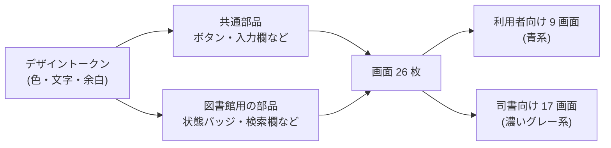

# デザインのレビュー要約

図書館蔵書管理システムの見た目と画面部品を用意しました。
このページは、何を作ったかと、自動で決めた点をまとめたものです。

## 全体像

- 画面は、要件に書かれた 26 画面だけを作りました。新しい画面は増やしていません。
- 各画面には「通常」「0 件」「読み込み中」「エラー」などの状態を用意しました。

## 利用者向けの画面 (スマートフォン対応)

| 画面 | 何をする画面か | 用意した状態 |
|---|---|---|
| 蔵書検索 | キーワード・タイトル・著者・ISBN・ジャンルで本を探す | 通常 / 0 件 / 読み込み中 / エラー |
| 書籍詳細 | 本の情報と、借りられるかを見る。貸出中なら予約へ進む | 在庫あり / 貸出中 / 読み込み中 / エラー |
| ログイン | 利用者番号とパスワードでログインする | 通常 / 入力誤り / 送信中 |
| 借りている本 (返却期限確認) | 借りている本と返却期限、残り日数を見る | 通常 / 0 件 / 読み込み中 / エラー |
| 予約申込 | 貸出中の本を予約する。予約順が分かる | 通常 / 完了 / 予約不可 (在庫あり) / エラー |
| 予約取消 | 予約中・取置中の予約を取り消す | 通常 / 完了 / エラー |
| 延滞中の本 | 返却期限を過ぎた本を確認する | 通常 / 0 件 / 読み込み中 / エラー |
| 貸出履歴 | 過去に借りた本の一覧を見る | 通常 / 0 件 / 読み込み中 / エラー |
| 予約状況 | 自分の予約の順番と進み具合を見る | 通常 / 0 件 / 読み込み中 / エラー |

## 司書向けの画面

| 画面 | 何をする画面か | 用意した状態 |
|---|---|---|
| 書籍の受入登録 | 新しい本を登録する。同じ ISBN は登録できない | 通常 / ISBN 重複 / 送信中 / エラー |
| 書籍情報の編集 | 登録済みの本の情報を直す | 通常 / 入力誤り / 読み込み中 / エラー |
| 除籍の確認 | 本を削除する。貸出中・取置中の本は削除できない | 通常 / 削除不可 / 読み込み中 / エラー |
| 所蔵の検索 | 所蔵している本を探し、編集・除籍へ進む | 通常 / 0 件 / 読み込み中 / エラー |
| 利用申込の受付 | 利用者を登録して利用者番号を渡す | 通常 / 入力誤り / 送信中 / エラー |
| 利用者情報の編集 | 利用者の情報を直す | 通常 / 読み込み中 / エラー |
| 利用登録の抹消確認 | 利用者を削除する。貸出・予約が残る人は削除できない | 通常 / 削除不可 / 読み込み中 / エラー |
| 貸出の受付 | 利用者番号と本の番号で貸し出す。返却期限を自動で表示する | 通常 / 完了 / 貸出不可 / エラー |
| 返却の受付 | 本の番号で返却を受ける。予約がある本は取置へ回す案内を出す | 通常 / 完了 / 完了 (予約あり) / エラー |
| 取置の手続 | 返ってきた予約本を予約 1 番目の人のために取り置く | 通常 / 登録済み / 0 件 / エラー |
| 予約待ちの一覧 | 本ごとの予約者と順番を見る | 通常 / 0 件 / 読み込み中 / エラー |
| 連絡漏れの確認 | 取置・返却期限・督促のメールが届いたかを見る | 通常 / 0 件 / 読み込み中 / エラー |
| 延滞の一覧 | 返却期限を過ぎた貸出と督促メールの状況を見る | 通常 / 0 件 / 読み込み中 / エラー |
| 利用者の問い合わせ対応 | 利用者番号から、その人の貸出・予約を見る | 通常 / 見つからない / 読み込み中 / エラー |
| 在庫状況レポート | 状態別・ジャンル別の冊数を見る | 通常 / 読み込み中 / エラー |
| 人気の本ランキング | 期間内によく借りられた本を順に見る | 通常 / 任意期間 / 0 件 / 読み込み中 / エラー |
| 期間別の貸出分析 | 期間ごとの貸出件数を見る | 通常 / 任意期間 / 0 件 / 読み込み中 / エラー |

## 部品の一覧

**共通部品 (どの画面でも使う)**

| 部品 | 用途 |
|---|---|
| ボタン | 登録・保存・削除などの操作 (通常 / 控えめ / 枠線 / 文字だけ / 削除用、大中小) |
| バッジ | 状態を色付きの小さなラベルで示す |
| カード | 情報をまとめる枠 |
| 入力欄・選択欄 | 項目名・補足・エラー表示つきの入力 |
| お知らせ枠 | 完了・注意・エラーのメッセージ |
| 表 | 一覧。狭い画面では横にスクロールする |
| 確認ダイアログ | 削除・取消の前の確認。実行できない理由も表示できる |
| 読み込み中・0 件・エラーの表示 | 画面の状態切り替え |

**図書館用の部品**

| 部品 | 用途 |
|---|---|
| 状態バッジ (本・貸出・予約・通知・利用者) | 状態の名前と色を両方の画面で統一する |
| 書籍検索欄 | 検索条件を選んで本を探す。「在庫ありのみ」の切り替えつき |
| 書籍カード・書籍情報 | 本の一覧表示と詳しい情報 |
| 書籍フォーム・利用者フォーム | 登録と編集の入力欄 |
| 利用者情報 | 連絡先・電話番号・住所を伏せ字で表示する |
| 伏せ字表示 | 個人情報を隠し、権限のある人だけが表示を切り替える |
| 返却期限の表示 | 期限と残り日数。3 日前から注意色、過ぎたら警告色 |
| 予約の進み具合 | 予約中 → 取置中 → 受取済み の段階表示 |
| カウンター入力 | 利用者番号と本の番号の入力 (バーコード読み取りを想定) |
| 集計期間の切り替え | 日次・週次・月次・年次・任意期間 |
| 数値カード・横棒グラフ | レポートの主な数値と内訳 |

**画面の枠**: 利用者向けは上部メニュー、司書向けは左メニューです。

## 状態の色 (両方の画面で共通)

| 情報 | 緑 | 青 | 橙 | 赤 | 灰 |
|---|---|---|---|---|---|
| 本 | 在庫あり | 貸出中 | 予約待ち (取置) | - | 削除済み |
| 貸出 | - | 貸出中 | - | 延滞 | 返却済み |
| 予約 | 受取済み | 予約中 | 取置中 | - | 取消済み |
| 通知 | 送信済み | 送信待ち | - | 送信失敗 | - |
| 利用者 | 有効 | - | - | - | 削除済み |

## 見た目の決まりごと

- **主要色**: 利用者向けは青 (#2563EB)、司書向けは濃いグレー (#334155)。どちらの画面か一目で分かります。
- **文字**: 日本語が読みやすいゴシック体 (Noto Sans JP → ヒラギノ → メイリオの順)。本文の行間は広め (1.7)。
- **余白**: 4px を単位にしています。画面の外周 24px、区切り 32px、部品の間 12px、カードの内側 24px です。
- **幅**: 一覧は最大 1280px、登録・編集フォームは最大 768px で中央に置きます。司書向けの左メニューは 192px (メニュー 6 項目)。
- **読みやすさ**: JIS X 8341-3 の AA を目標に、文字と背景のコントラストを 4.5:1 以上にしています。キーボード操作時は枠線 (フォーカスリング) を表示します。
- **ダークモード**: すべての色に暗い配色を用意しました。

## 自動で決めた点 (確信度が低いもの)

人の確認がないまま、推奨案を採用しました。気になる点があれば指摘してください。

| 決めたこと | 理由 | 別の案 |
|---|---|---|
| 司書向けの色を濃いグレーにした | 館内の業務用画面として落ち着いた色にし、利用者向けの青と区別するため | 緑系など、図書館らしい色 |
| 書体は外部から読み込まず、端末の日本語書体を使う | 読み込みを速くし、外部への通信をなくすため | Web フォントを配布して見た目を揃える |
| 利用者向けの画面名を短い言葉にした (例: 「借りている本」) | メニューの幅に収め、一般の人に分かりやすくするため | 要件の画面名 (返却期限確認画面) をそのまま使う |
| 司書向けのログイン画面は作っていない | 要件に司書のログイン画面がないため | 司書用のログイン画面を追加する (要件の追加が必要) |
| 利用者のログインを「利用者番号 + パスワード」にした | 要件に認証方法の記載がなかったため | メールアドレスでのログイン、館内カードの利用 |
| 返却期限の注意色を 3 日前からにした | リマインドを送る時期 (3 日前) に合わせたため | 1 日前から |
| 削除できない本・利用者は、確認画面で理由を出してボタンを押せなくする | 押してからエラーになるより分かりやすいため | 一覧の段階で削除ボタンを隠す |

## 仕様がまだ決まっていない画面

次の画面は、要件側で詳しい決まり (受入基準) がまだありません。画面は要件の説明から推測して作りました。

- 予約取消
- 予約待ちの一覧
- 連絡漏れの確認
- 延滞の一覧
- 利用者の問い合わせ対応

## 確認方法

- 部品と画面は Storybook で確認できます。上部のツールバーで「利用者向け / 司書向け」「Light / Dark」を切り替えられます。
- 目視確認の結果は、この下の「目視確認」に記録しています。

## 目視確認

実施済みです。全 141 の表示パターンを、PC 幅 (1280px) とスマートフォン幅 (390px)、明るい配色と暗い配色で開きました。

| 確認したこと | 結果 |
|---|---|
| 画面の横はみ出し | なし |
| 文字の切れ・省略 | なし (修正後) |
| 文字と背景のコントラスト (自動検査) | 違反なし |
| 入力欄・ボタンの読み上げ名 (自動検査) | 違反なし |

見つけて直した点:

- 検索欄の入力枠の高さがつぶれていた → 入力欄の幅指定を直した。
- スマートフォンで予約の進み具合の文字が「予…」と切れていた → 数字の下に文字を置く形に変えた。

残っている点:

- 司書向け画面をスマートフォン幅で開くと、上部メニューは横スクロールになる。司書向けは PC での利用を前提とするため、このままにした。
