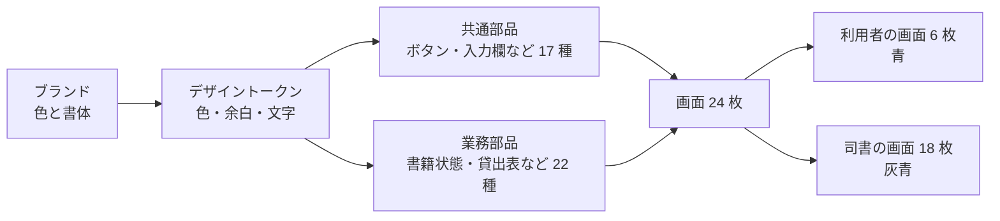

# デザインの要約 (図書館蔵書管理システム)

画面の部品集と、画面ごとの見た目の下書きを作りました。
このページは、その中身を前提知識なしで確かめるための要約です。

## 1. 全体像

- 利用者と司書は 1 つのアプリを使います。画面の主要色で見分けます。
  - 利用者の画面: 落ち着いた青。上部に横並びのメニュー。
  - 司書の画面: 灰青。左側に業務ごとのメニュー。
- どの画面にも「読み込み中」「読み込み失敗」の表示を用意しました。一覧の画面には「0 件」の表示もあります。

## 2. 業務ごとの画面

### 利用者の画面

| 画面 | 何をする画面か | 用意した表示の種類 |
|---|---|---|
| 本をさがす | キーワード・タイトル・著者・ISBN・ジャンルで本を探す | 結果あり / 0 件 / 検索中 / 失敗 |
| 書籍の詳細 | 本の情報といまの状態 (在庫あり・貸出中・予約待ち) を見る。貸出中なら予約へ進む | 在庫あり / 貸出中 / 読み込み中 / 失敗 |
| 予約の申し込み | 貸出中の本を予約する。在庫のある本は予約できない | 申し込み前 / 受付完了 / 予約できない本 / 失敗 |
| 借りている本 | いま借りている本と返却期限、過去に借りた本を分けて見る | いまの貸出 / 過去の貸出 / 0 件 / 読み込み中 / 失敗 |
| 予約状況 | 自分の予約と順番 (何番目か) を見る | 予約あり / 0 件 / 読み込み中 / 失敗 |
| 予約の取り消し | 自分の予約を取り消す | 確認 / 取消完了 / 失敗 |

### 司書の画面

| 業務 | 画面 | 何をする画面か |
|---|---|---|
| 蔵書管理 | 書籍の登録 | 受け入れた本を登録する (入力誤り・登録中・完了の表示つき) |
| 蔵書管理 | 書籍情報の編集 | 登録済みの本の情報を直す |
| 蔵書管理 | 書籍の削除 | 本を削除する。貸出中の本は削除ボタンを押せない |
| 蔵書管理 | 蔵書一覧 | 登録された本を、紙・電子の区別といまの状態つきで一覧する |
| 蔵書管理 | 蔵書検索 | 問い合わせを受けた本を探し、いまの状態を案内する |
| 利用者管理 | 利用者の登録 | 氏名と連絡先を登録する。利用者番号は自動で振られる |
| 利用者管理 | 利用者情報の編集 | 氏名・連絡先を直す |
| 利用者管理 | 利用者の削除 | 利用者を削除する。本を借りている人は削除ボタンを押せない |
| 貸出 | 貸出受付 1: 利用者の確認 | 利用者番号で借りる人を特定する |
| 貸出 | 貸出受付 2: 貸出できるかの確認 | 本が貸し出せるかを確かめる。可否を色・アイコン・文字で示す |
| 貸出 | 貸出受付 3: 貸出の登録 | 内容を確かめて登録する。返却期限は自動で決まる |
| 返却 | 返却受付 | 返却を登録する。予約のある本なら「取り置いてください」と出す |
| 返却 | 取り置き中の書籍 | 予約者の受け取りを待つ本を見る |
| 期限管理 | 延滞状況 | 期限切れの貸出と、自動で送ったお知らせの記録を見る |
| 予約 | 予約受付状況 | 本ごとの予約と順番を見る |
| 蔵書分析 | 在庫状況 | 在庫あり・貸出中・予約待ちの冊数を見る |
| 蔵書分析 | 人気書籍ランキング | よく借りられている本を順に見る。上位 3 冊は琥珀色で示す |
| 蔵書分析 | 期間別貸出統計 | 開始日と終了日を決めて貸出件数を集計する |

### 画面を作らなかったもの

- 返却のお知らせ・返却期限のお知らせ・延滞返却のお願いの 3 つはメールです。Web 画面は作っていません。

## 3. 部品の一覧

| 分類 | 部品 |
|---|---|
| 共通 (17) | ボタン、ラベル (バッジ)、カード、入力欄、選択欄、表、通知枠、読み込み中表示、0 件表示、ページ送り、タブ、集計値カード、確認パネル、期間入力、画面見出し、画面の外枠、アイコン |
| 業務 (22) | 書籍状態・貸出状態・予約状態・媒体種別・通知種別の各ラベル、書籍の検索条件、蔵書の表、検索結果カード、書籍の詳細、書籍の入力フォーム、利用者の入力フォーム、利用者の要約カード、個人情報の伏せ字、貸出可否の判定結果、返却期限の表示、貸出の表、予約の表、予約の進み具合、お知らせの送信記録、在庫状況の集計、ランキングの表、貸出統計の結果 |

- 状態は色だけで伝えません。必ず文字 (在庫あり・延滞など) を添えます。
- 司書の画面の一覧では、利用者の氏名とメールアドレスを伏せ字にします (例: 佐\*\*\*、h\*\*\*@example.jp)。

## 4. 色・文字・余白

| 項目 | 決めたこと |
|---|---|
| 主要色 | 落ち着いた青 #1F5F8B (利用者の画面) / 灰青 #4C5660 (司書の画面) |
| 副色 | 緑 #2E7D6B。貸出・返却の登録ボタンに使う |
| 強調色 | 琥珀 #C8812A。ランキング上位と「受け取り待ち」に使う。文字の色には使わない (白地で読みにくいため) |
| 中間色 | 灰青 #5F6B76。補足の文字に使う |
| 状態の色 | 在庫あり = 緑、貸出中 = 青、予約待ち = 橙、延滞・エラー = 赤 |
| 書体 | 見出し・本文とも Noto Sans JP。入っていない端末ではヒラギノ角ゴ・游ゴシックで表示する |
| 余白 | 4px 刻み。画面の外周 24px、区画の間 32px、部品の間 12px、カードの内側 24px |
| 左メニュー幅 | 192px (司書のメニューは業務 5 つ + 共通 2 つの 7 項目で、8 項目以下のため) |
| 画面の最大幅 | 1280px。入力フォームは 672px で中央に置く |
| 暗い表示 | 暗い表示 (ダークモード) にも対応した |

## 5. ブランドの由来

- 由来: **推論 (低確信)**。プロジェクトにブランド資料が無いため、決定記録 (UI の方針) で「公共図書館・1 館・利用者と司書」から色と書体を仮に決めています。
- デザインはこの仮の色と書体をそのまま使いました。デザイン側で色を決め直してはいません。

## 6. 確認してほしいこと

| # | 内容 | いまの仮の決定 |
|---|---|---|
| 1 | ブランドの色 4 つ (青・緑・琥珀・灰青) でよいか | 仮置きのまま採用 |
| 2 | 書体を Noto Sans JP にするか | 仮置きのまま採用。Web フォントは読み込まず、端末に無ければ標準書体で表示する |
| 3 | 司書の画面の主要色を灰青にするか | 利用者 = 青、司書 = 灰青 (画面の取り違えを防ぐため) |
| 4 | スマートフォン向けの画面最適化をしないでよいか | 非機能要求で端末対応が最低水準のため、パソコン向けを基準にした。幅が狭いと表は横スクロールになる |
| 5 | 仕様が決まっていない 4 画面の扱い | 予約の取り消し・取り置き中の書籍・延滞状況・予約受付状況は、画面の骨組みだけ作り「仕様は確定していません」と表示した |
| 6 | 利用者の画面の言い回し | 予約状態を利用者向けに言い換えた (通知済 → 受け取り待ち、完了 → 貸出済み) |

## 7. 見た目の確認 (目視)

- 全 156 通りの表示を自動で撮影し、はみ出し・文字切れ・読みにくい色が無いことを確かめました。
- 撮影した画像は `docs/design/screenshots/` にあります (一覧は同じ場所の `index.md`)。
- 確かめて直したこと:
  - 司書の左メニューが画面の途中で切れていた → 画面の下端まで伸ばした。
  - 延滞の行を赤く塗ると「延滞」ラベルが背景に溶けた → 行の左端に赤い帯を付ける形に変えた。
  - 通知枠の中のラベルが背景に溶けた → ラベルに薄い枠線を付けた。
  - 集計期間の入力で、エラー時にボタンの位置がずれた → エラー文を入力欄の下 1 行にまとめた。
