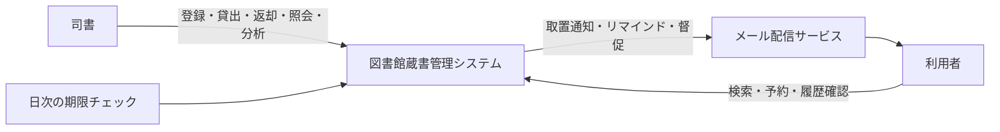
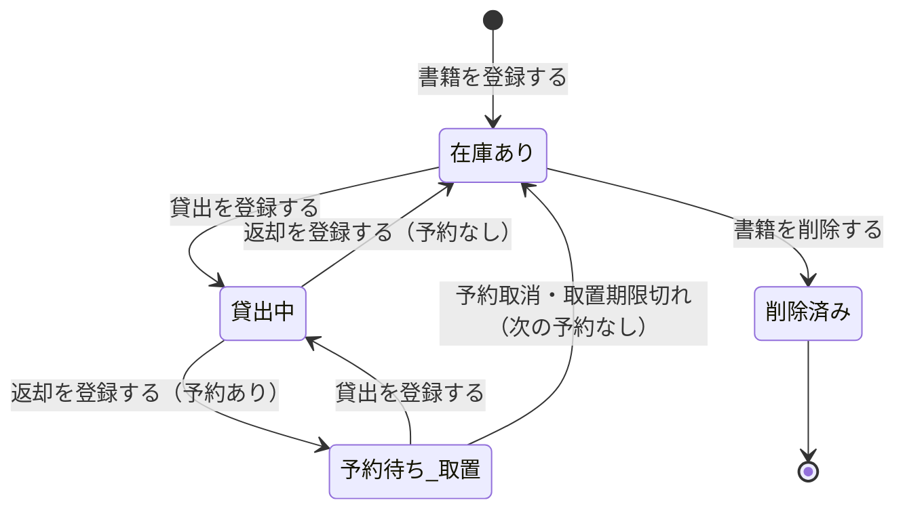
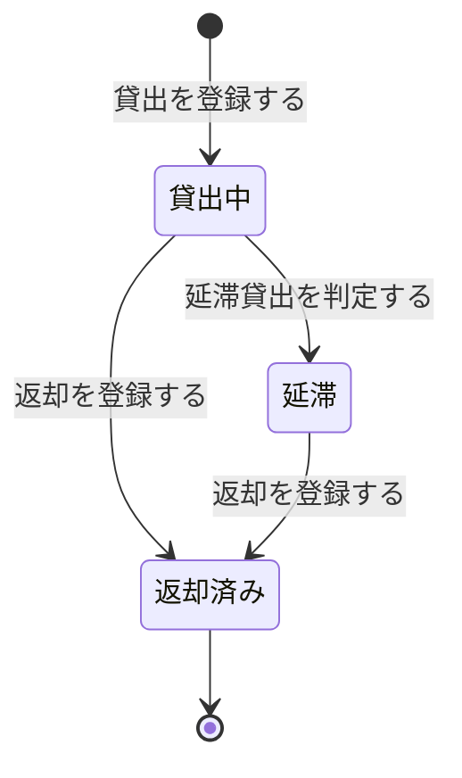
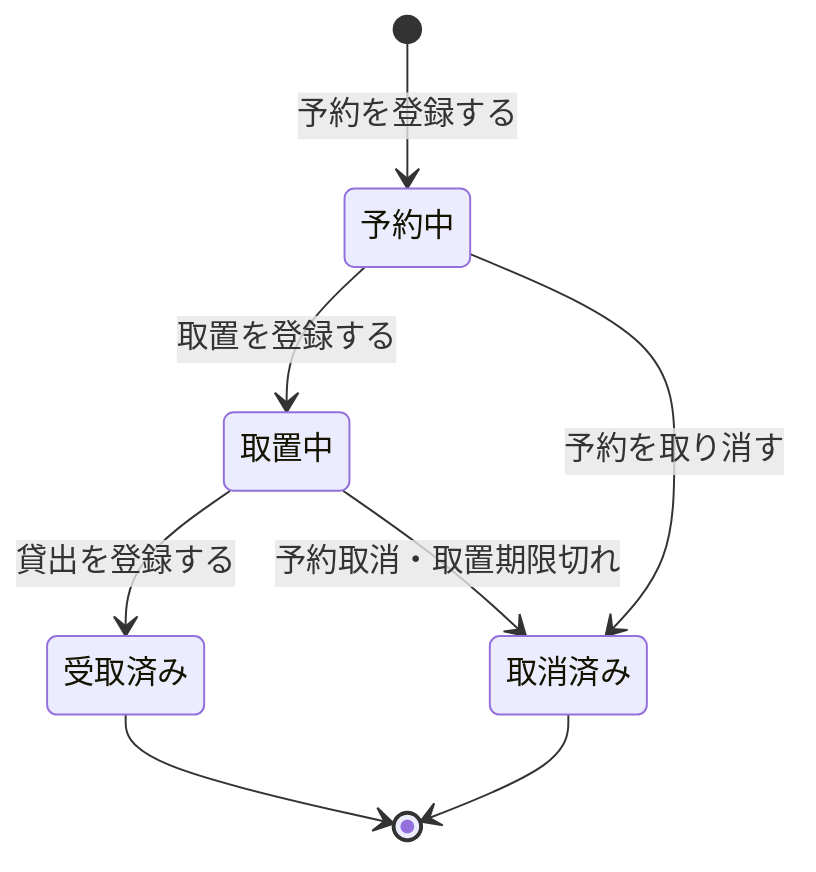

# 要求の確認材料（図書館蔵書管理システム）

初期要望から要求・仕様・受入基準と RDRA モデルを作りました。
この資料で「業務の範囲・ルール・状態・受入基準がこれで合っているか」を判断してください。

## 1. 全体像

| 業務 | UC 数 | 概要 |
|---|---|---|
| 蔵書管理業務 | 6 | 書籍の登録・変更・削除・検索 |
| 利用者管理業務 | 4 | 利用者の登録・変更・削除とログイン |
| 貸出業務 | 19 | 貸出・返却・予約・取置・期限通知・督促・利用状況確認 |
| 蔵書分析業務 | 3 | 在庫状況・人気書籍・貸出統計のレポート |
| 合計 | 32 | |

## 2. UC 一覧

### 蔵書管理業務

| UC | アクター | 一言説明 |
|---|---|---|
| 書籍を登録する | 司書 | タイトル・著者・ISBN・出版社・ジャンル・媒体種別を入れて登録する |
| 書籍情報を変更する | 司書 | 登録済みの書籍情報を編集する |
| 書籍を削除する | 司書 | 在庫ありの書籍だけを除籍する |
| 書籍詳細を表示する | 利用者 | 書籍の詳細と在庫状況を見る |
| 書籍を検索する | 利用者 | キーワード・タイトル・著者・ISBN・ジャンルで探す |
| 所蔵書籍を検索する | 司書 | 問い合わせに応じて蔵書を探し、所在を案内する |

### 利用者管理業務

| UC | アクター | 一言説明 |
|---|---|---|
| 利用者を登録する | 司書 | 氏名・連絡先を登録し、利用者番号を付ける |
| 利用者情報を変更する | 司書 | 氏名・連絡先を編集する |
| 利用者を削除する | 司書 | 貸出・予約を持たない利用者だけを削除する |
| ログインする | 利用者 | 利用者番号で Web 画面に入る |

### 貸出業務

| UC | アクター | 一言説明 |
|---|---|---|
| 貸出を登録する | 司書 | 利用者と書籍を指定して貸し出し、返却期限を自動設定する |
| 貸出内容を照会する | 利用者 | 借りている書籍と返却期限を見る |
| 返却を登録する | 司書 | 返却日を記録し、予約の有無で書籍の状態を決める |
| 取置を登録する | 司書 | 返却された予約本を予約順 1 位の人のために取り置く |
| 取置を通知する | （自動） | 予約順 1 位の人にだけ取置をメールで知らせる |
| 予約を登録する | 利用者 | 貸出中の書籍を先着順で予約する |
| 予約を取り消す | 利用者 | 自分の予約を取り消し、後ろの順番を繰り上げる |
| 書籍の予約状況を照会する | 司書 | 書籍ごとの予約者と順番を見る |
| 取置期限切れの予約を取り消す | （日次自動） | 受け取られない取置を解除し、次の人へ回す |
| 返却期限間近の貸出を抽出する | （日次自動） | リマインド対象の貸出を選ぶ |
| 返却期限リマインドを送信する | （日次自動） | 期限前のリマインドメールを送る |
| 通知送信状況を照会する | 司書 | メールの送信成否を確認し、連絡漏れを防ぐ |
| 延滞貸出を判定する | （日次自動） | 期限を過ぎた未返却の貸出を延滞にする |
| 督促を送信する | （日次自動） | 延滞者へ督促メールを送る |
| 延滞貸出一覧を照会する | 司書 | 延滞中の貸出・延滞日数・督促状況を一覧で見る |
| 延滞中の貸出を確認する | 利用者 | 自分の延滞中の書籍と期限を見る |
| 貸出履歴を照会する | 利用者 | 自分の過去・現在の貸出を見る |
| 予約状況を照会する | 利用者 | 自分の予約と順番を見る |
| 利用者の利用状況を照会する | 司書 | 指定した利用者の貸出・予約を見る |

### 蔵書分析業務

| UC | アクター | 一言説明 |
|---|---|---|
| 在庫状況レポートを表示する | 司書 | 状態（在庫あり・貸出中・予約待ち）ごとの冊数を見る |
| 人気書籍ランキングを表示する | 司書 | 期間内の貸出回数順に並べる |
| 貸出統計を集計する | 司書 | 開始日と終了日を指定して貸出件数を集計する |

## 3. 業務ルール（条件・バリエーション）

| ルール | 要点 |
|---|---|
| 貸出の可否 | 在庫ありの書籍、または本人向けに取置中の書籍だけ貸し出せる。利用者が有効で、延滞中の貸出がなく、区分ごとの上限冊数以内であること |
| 返却期限の算出 | 貸出日＋貸出期間（7 日・14 日・21 日）。利用者区分と媒体種別で期間を選ぶ |
| 返却時の扱い | 予約があれば「予約待ち（取置）」、なければ「在庫あり」に戻す |
| 予約の可否 | 貸出中または取置中の書籍だけ予約できる。在庫ありの書籍と同じ書籍への重複予約は不可 |
| 予約順 | 受付日時の先着順。取消・受取で繰り上げる |
| 取置期限 | 取置開始日＋所定の取置日数。期限切れは取消し、次の予約者へ回す |
| リマインド | 返却期限の 3 日前と 1 日前に送る |
| 延滞・督促 | 期限を過ぎた未返却を日次で延滞にし、督促メールを送る |
| 通知 | 種別は取置通知・リマインド・督促。失敗した通知は再送対象にできる |
| 削除の可否 | 貸出中・取置中の書籍は削除不可。貸出・予約を持つ利用者は削除不可 |
| 閲覧範囲 | 利用者は自分の貸出・予約だけ見られる。管理操作とレポートは司書だけ |
| 媒体種別 | 紙・電子。現在は紙を扱い、電子書籍を後から追加できる形にする |
| 集計 | 集計期間は日次・週次・月次・年次・任意期間。ジャンル別にも分けられる |

## 4. 状態遷移

### 書籍の状態

### 貸出の状態

### 予約の状態

### 利用者と通知の状態

- 利用者: 登録で「有効」、削除で「削除済み」。
- 通知: 作成で「送信待ち」、送信結果で「送信済み」か「送信失敗」。失敗分は再送で「送信待ち」に戻せる。

## 5. 受入基準の要点

### 蔵書と利用者の一元管理（必須）

- 書籍を登録すると、蔵書として検索結果に出る。
- 書籍を編集すると、変更後の内容が表示される。
- 貸出中でない書籍を削除すると、検索結果から消える。
- 利用者を登録すると、利用者番号が付く。
- 利用者の連絡先を編集すると、変更後の内容が表示される。
- 貸出中の書籍を持たない利用者を削除すると、一覧から消える。
- キーワードで検索すると、タイトルや著者に含む書籍が出る。
- タイトル・著者・ISBN・ジャンルで検索すると、一致する書籍だけが出る。

### 貸出・返却・予約の Web 化（必須）

- 在庫ありの書籍を貸し出すと、書籍が「貸出中」になる。
- 貸出中の書籍は、重ねて貸し出せない。
- 返却すると返却日が記録され、書籍が「在庫あり」に戻る。
- 予約のある書籍が返却されると、書籍は「予約待ち（取置）」になる。
- 貸出中の書籍を予約すると、順番付きで「予約中」になる。
- 在庫ありの書籍は予約できない。
- 予約が複数ある書籍が返却されると、予約順 1 位の人にだけ通知が届く。

### 期限管理と通知の自動化（必須）

- 貸出を登録すると、返却期限が自動で設定される。
- 期限が近い未返却の貸出には、日次チェックでリマインドメールが届く。
- 期限を過ぎた未返却の貸出は日次チェックで延滞になり、督促メールが届く。

### 利用者の履歴・予約確認（推奨）

- 貸出履歴画面に、過去と現在の貸出が返却期限付きで出る。
- 他の利用者の貸出は表示されない。
- 予約状況画面に、予約中の書籍・予約順・状態が出る。

### 司書のレポート（推奨）

- 在庫状況レポートに、状態ごとの書籍と件数が出る。
- 人気書籍ランキングは、貸出回数の多い順に並ぶ。
- 開始日と終了日を指定すると、期間内の貸出件数が集計される。

### 電子書籍への備え（任意）

- 書籍は媒体種別付きで登録される。
- 検索結果に媒体種別が表示される。

## 6. 確認してほしい点（推奨を仮採用済み）

| 論点 | 仮採用した内容 |
|---|---|
| 貸出・返却・予約・期限通知・督促・利用状況確認の業務のまとめ方 | 1 つの「貸出業務」にまとめた |
| 貸出期間の値 | 7 日・14 日・21 日を利用者区分と媒体種別で選ぶ（要望に具体値なし） |
| リマインドの時期 | 返却期限の 3 日前と 1 日前（要望に具体値なし） |
| 取置の日数 | 「所定の取置日数」とし、値は未決定 |
| 利用者区分 | 一般・児童・学生（要望に記載なし。貸出期間と上限冊数の判断用） |
| 取置期限と取置期限切れの取消 | 要望にはないが、予約の運用に必要なため追加した |
| 自動処理の起動 | 日次の期限チェック（タイマー）で動かす |
| 対象館 | 1 館での運用。複数館は扱わない |

### 対応する仕様がなく保留にした UC

次の 6 UC は RDRA で業務上必要として追加しました。
ただし、要求に対応する仕様・受入基準がありません。
仕様を追加するか、UC を外すかを判断してください。

| UC | 足りない仕様 |
|---|---|
| 予約を取り消す | 予約の取消と、後続の予約順の繰り上げ |
| 書籍の予約状況を照会する | 司書が書籍ごとの予約者・予約順を確認すること |
| 取置期限切れの予約を取り消す | 取置期限と、期限切れ時の取消・次の予約者への取置 |
| 通知送信状況を照会する | 司書が通知の送信成否を確認すること |
| 延滞貸出一覧を照会する | 司書が延滞中の貸出と督促状況を一覧で確認すること |
| 利用者の利用状況を照会する | 司書が指定した利用者の貸出・予約を確認すること |
