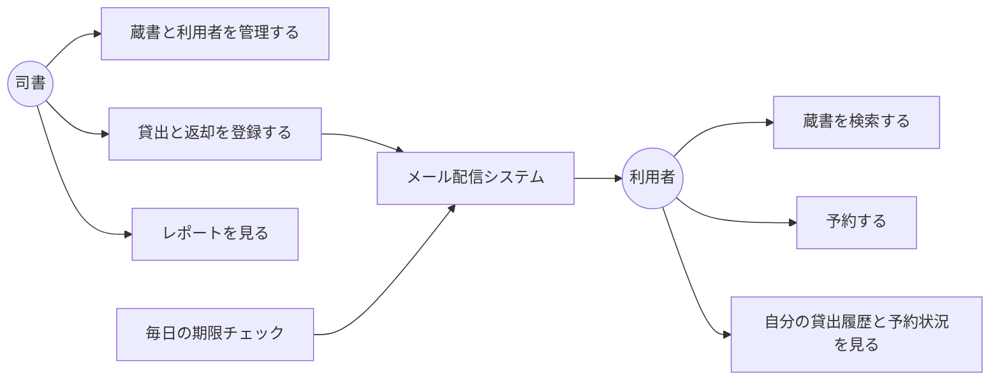
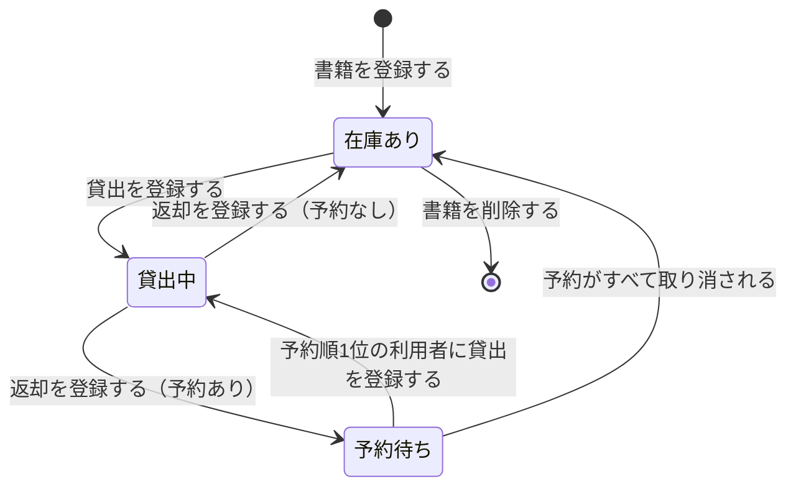
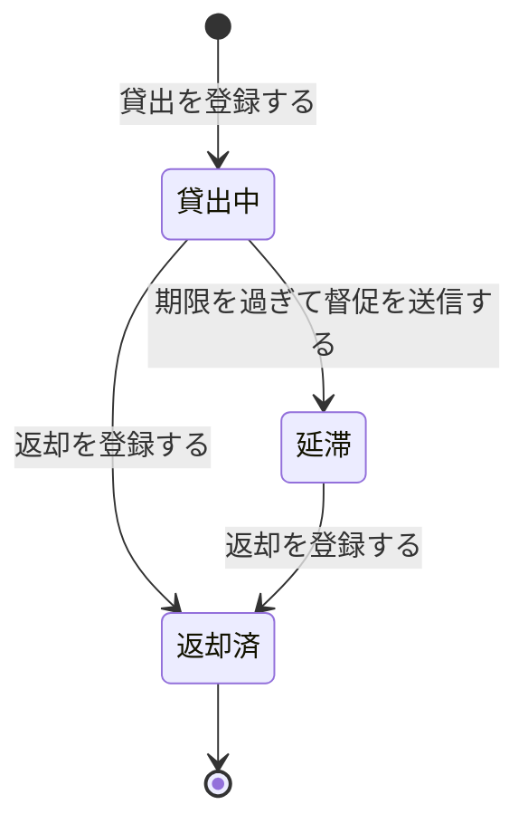
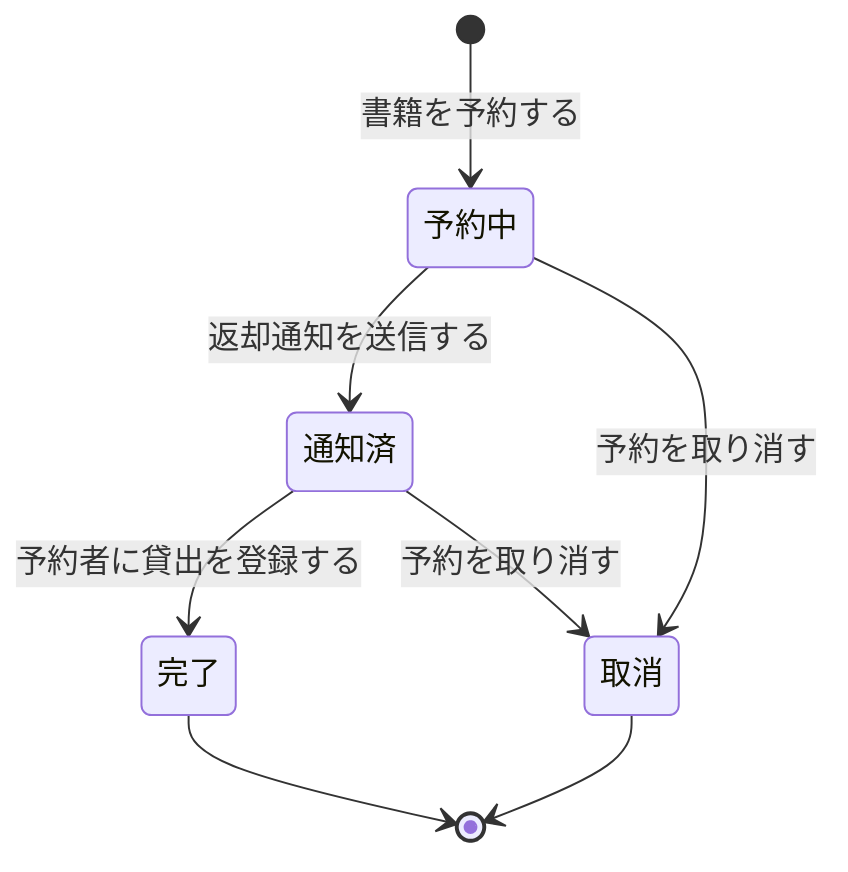

# 要求の確認材料: 図書館蔵書管理システム

紙台帳と表計算ファイルに分散した蔵書・利用者の情報を一元管理し、貸出・返却・予約と期限通知を自動化するシステムの要求を整理した。
この資料で確認してほしいのは次の 4 点。

1. 業務と UC の一覧に過不足が無いか
2. 業務ルールの解釈が正しいか
3. 書籍・貸出・予約の状態の移り変わりが正しいか
4. 受入基準が「できた」と判断できる内容か

## 全体像

- アクター: 利用者、司書の 2 種類
- 外部システム: メール配信システム（返却通知・リマインド・督促の送信に使う）
- 運用範囲: 1 館での運用を想定する
- 画面: Web 画面を持つ

## 1. UC 一覧

全 27 件。うち 4 件は、要望に対応する記述が無いため「保留」にした（後述の「判断してほしいこと」を参照）。

### 蔵書管理業務

| UC | アクター | 一言説明 |
|---|---|---|
| 書籍を登録する | 司書 | タイトル・著者・ISBN・出版社・ジャンル・媒体種別を入力して蔵書に加える |
| 書籍情報を編集する | 司書 | 登録済みの書籍情報を修正する |
| 書籍を削除する | 司書 | 貸出されていない書籍を蔵書から外す |
| 蔵書一覧を確認する | 司書 | 登録された蔵書を媒体種別・状態つきで一覧する |
| 書籍を検索する | 利用者 | キーワード・タイトル・著者・ISBN・ジャンルで探す |
| 書籍の詳細を参照する | 利用者 | 検索結果から書籍を選び、媒体種別と在庫状況を確かめる |
| 蔵書を検索する | 司書 | 利用者の問い合わせに応じて蔵書を探す |

### 利用者管理業務

| UC | アクター | 一言説明 |
|---|---|---|
| 利用者を登録する | 司書 | 氏名・連絡先を入力し、一意の利用者番号を付ける |
| 利用者情報を編集する | 司書 | 氏名・連絡先を修正する。新しい連絡先が以後の通知に使われる |
| 利用者を削除する | 司書 | 貸出中の書籍が無い利用者を外す |
| 貸出履歴を照会する | 利用者 | 自分の現在の貸出（返却期限つき）と過去の貸出を見る |
| 予約状況を照会する | 利用者 | 自分の予約中の書籍と予約順位を見る |

### 貸出業務

| UC | アクター | 一言説明 |
|---|---|---|
| 利用者を特定する | 司書 | 貸出の相手を利用者番号で確かめる |
| 貸出可否を確認する | 司書 | その書籍を貸し出せるかを判定する |
| 貸出を登録する | 司書 | 貸出を記録し、返却期限を自動で設定する |
| 返却を登録する | 司書 | 返却を記録し、書籍を在庫ありまたは予約待ちに戻す |
| 返却通知を送信する | 利用者（受け手） | 予約のある書籍が返却されたら、予約順 1 位の利用者にメールで知らせる |
| 返却期限のリマインドを送信する | 利用者（受け手） | 毎日の期限チェックで、期限が近い貸出の利用者にメールを送る |
| 延滞の督促を送信する | 利用者（受け手） | 毎日の期限チェックで、期限を過ぎた貸出を延滞にし、督促メールを送る |
| 予約待ちの書籍を確認する（保留） | 司書 | 返却後に取り置く書籍と受取予定の利用者を一覧する |
| 延滞中の貸出を確認する（保留） | 司書 | 延滞中の貸出と通知の送信記録を一覧する |

### 予約業務

| UC | アクター | 一言説明 |
|---|---|---|
| 書籍を予約する | 利用者 | 貸出中の書籍を予約し、受付順の予約順位を得る |
| 予約を取り消す（保留） | 利用者 | 自分の予約を取り消し、後ろの予約者を繰り上げる |
| 予約一覧を確認する（保留） | 司書 | 書籍ごとの予約と予約順位を見る |

### 蔵書分析業務

| UC | アクター | 一言説明 |
|---|---|---|
| 在庫状況レポートを確認する | 司書 | 在庫あり・貸出中・予約待ちごとの書籍と件数を見る |
| 人気書籍ランキングを確認する | 司書 | 貸出回数の多い順に書籍を見る |
| 貸出統計を集計する | 司書 | 開始日と終了日を指定し、期間内の貸出件数を見る |

## 2. 業務ルール

| ルール | 内容 |
|---|---|
| 書籍の検索 | キーワード・タイトル・著者・ISBN・ジャンルのいずれかで絞り込む。削除した書籍は対象外 |
| 貸出できる条件 | 書籍が在庫ありであること。予約待ちの書籍は予約順 1 位の利用者にだけ貸し出せる。貸出中の書籍は貸し出せない |
| 予約できる条件 | 貸出中の書籍だけ予約できる。在庫ありの書籍は予約できない。予約順位は受付順 |
| 返却期限の決め方 | 貸出日に貸出期間を加えた日 |
| リマインドの送信 | 未返却で、期限までの日数がリマインド日数以内になったら 1 回だけ送る |
| 督促の送信 | 未返却で期限を過ぎたら、貸出を延滞にして督促メールを送る |
| 集計期間 | 司書が指定した開始日から終了日までの貸出を集計する |
| 削除の制約 | 貸出中の書籍は削除できない。貸出中の書籍を持つ利用者は削除できない |

区分（バリエーション）:

| 区分 | 値 |
|---|---|
| 媒体種別 | 紙の書籍、電子書籍（現時点は紙の書籍を扱い、電子書籍を後から追加できる構造にする） |
| 通知の種類 | 返却通知、リマインド、督促 |
| レポートの種類 | 在庫状況レポート、人気書籍ランキング、貸出統計 |

## 3. 状態の移り変わり

### 書籍の状態

### 貸出の状態

### 予約の状態

## 4. 受入基準の要点

### 蔵書と利用者の管理

- 司書がタイトル・著者・ISBN・出版社・ジャンルを入力して登録すると、書籍が蔵書一覧に表示される
- 司書が書籍情報を編集して保存すると、変更後の情報が表示される
- 貸出されていない書籍を削除すると、蔵書一覧と検索結果に表示されなくなる
- キーワードで検索すると、キーワードを含む書籍が表示される
- タイトル・著者・ISBN・ジャンルのいずれかで検索すると、一致する書籍だけが表示される
- 氏名と連絡先で利用者を登録すると、一意の利用者番号が付く
- 利用者の連絡先を編集すると、以後の通知に新しい連絡先が使われる
- 貸出中の書籍が無い利用者を削除すると、利用者一覧に表示されなくなる

### 貸出・返却・予約

- 在庫ありの書籍を貸し出すと、貸出が記録され、書籍が貸出中になる
- 貸出中の書籍を重ねて貸し出そうとすると、貸出できない旨が表示され、記録されない
- 予約の無い書籍を返却すると、書籍が在庫ありになる
- 予約のある書籍を返却すると、書籍が予約待ちになる
- 貸出中の書籍を予約すると、受付順の予約順位が付く
- 在庫ありの書籍を予約しようとすると、予約できない旨が表示される
- 予約のある書籍が返却されると、予約順 1 位の利用者に返却通知メールが届く
- 予約の無い書籍が返却されても、返却通知メールは送られない

### 期限管理

- 貸出を登録すると、貸出日に貸出期間を加えた日が返却期限になる
- 毎日の期限チェックで、期限が近い未返却の貸出の利用者にリマインドメールが 1 回届く
- 毎日の期限チェックで、期限を過ぎた未返却の貸出が延滞になり、督促メールが届く

### 利用状況の確認とレポート

- 利用者の貸出履歴画面に、現在の貸出（返却期限つき）と過去の貸出が区別して表示される
- 貸出履歴画面に、他の利用者の貸出は表示されない
- 利用者の予約状況画面に、予約中の書籍と現在の予約順位が表示される
- 在庫状況レポートに、状態ごとの書籍と件数が表示される
- 人気書籍ランキングに、貸出回数の多い順に書籍が並ぶ
- 期間を指定した貸出統計に、期間内の貸出件数が表示される

### 電子書籍への備え

- 媒体種別に紙の書籍を指定して登録すると、媒体種別つきで登録される
- 書籍情報を表示すると、媒体種別が表示される

## 判断してほしいこと

### 保留にした 4 つの UC

業務の流れを整理すると必要になるが、要望には記述が無い操作を 4 つ見つけた。
推測で仕様を足さず、「保留」にしている。

| UC | 保留の理由 | 推奨 |
|---|---|---|
| 予約を取り消す | 予約の取消について要望に記述が無い | ⭐要望に追加する。取消が無いと、不要になった予約が順位を占め続ける |
| 予約待ちの書籍を確認する | 返却後の取り置き作業について要望に記述が無い | ⭐要望に追加する。返却通知を受けた利用者に渡す書籍を司書が探せない |
| 延滞中の貸出を確認する | 要望は通知の自動化だけで、司書の確認画面の記述が無い | 必要なら追加する |
| 予約一覧を確認する | 司書が予約を一覧する操作の記述が無い | 必要なら追加する |

### 決まっていない値と前提

要望に具体的な値が無いため、後段で決める必要がある。

- 貸出期間（何日借りられるか）
- リマインドを送る日数（期限の何日前か）
- 1 人が同時に借りられる冊数の上限
- 延滞中の利用者への貸出停止などのペナルティの有無
- 予約の取り置き期限（通知後、何日まで受け取りを待つか）
- 利用者のログイン方法（利用者が自分の履歴を見るための本人確認の手段）
- 利用者自身による Web での利用登録の要否（現状は司書が窓口で登録する前提）
