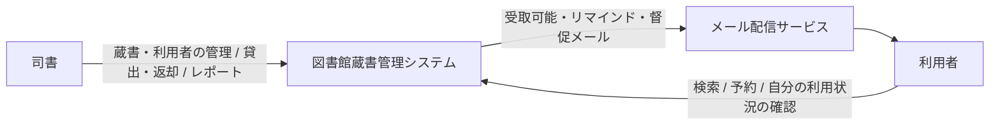
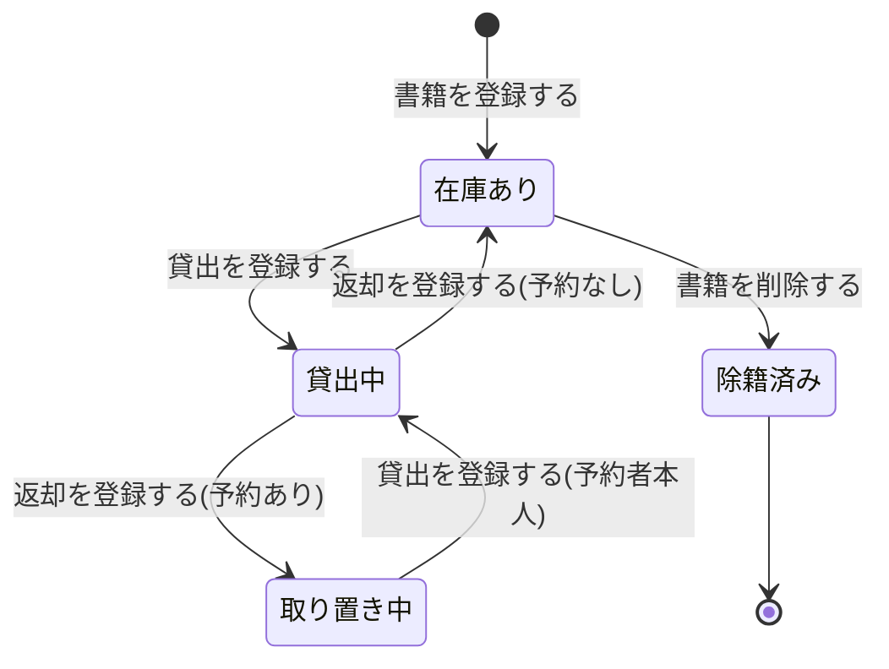
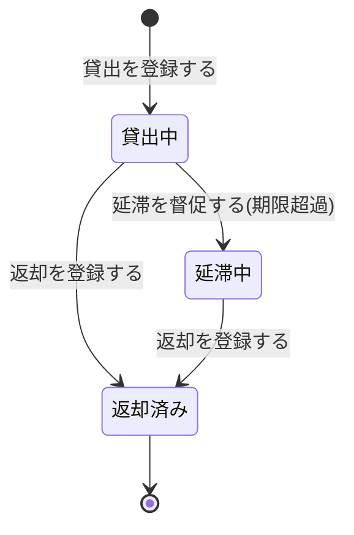
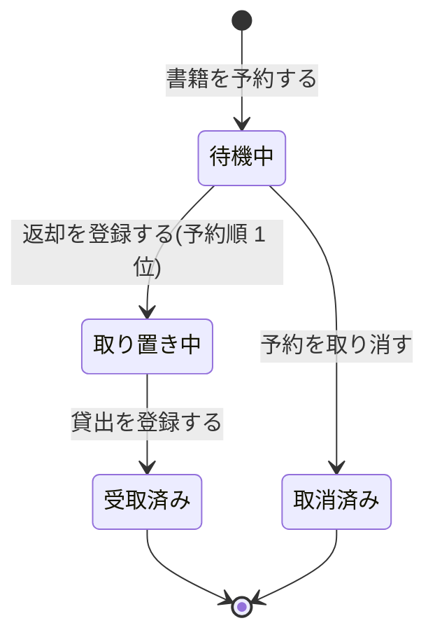

# 要求定義の確認材料: 図書館蔵書管理システム

この資料は、初期要望から整理した要求・業務・ユースケースの要約です。
「これで合っているか」を判断するための材料です。

## 1. システムの全体像

- 対象: 1 館の図書館
- 使う人: 司書、図書館の利用者(2 種類)
- 使う手段: Web 画面
- 連携先: メール配信サービス(受取可能通知・返却期限リマインド・延滞督促の送信)

## 2. UC 一覧(7 業務・22 ユースケース)

| 業務 | ユースケース | アクター | 一言説明 |
|---|---|---|---|
| 蔵書管理 | 司書がログインする | 司書 | 司書用の管理機能を使えるようにする |
| 蔵書管理 | 書籍を登録する | 司書 | タイトル・著者・ISBN・出版社・ジャンル・媒体種別を登録する |
| 蔵書管理 | 書籍情報を編集する | 司書 | 登録済みの書籍情報を変更する |
| 蔵書管理 | 書籍を削除する | 司書 | 貸出中・予約ありでない書籍を蔵書から除く |
| 蔵書管理 | 書籍を検索する | 利用者 | キーワード・タイトル・著者・ISBN・ジャンルで探し、在庫状況を見る |
| 蔵書管理 | 書籍の所在を検索する | 司書 | 問い合わせ対応で同じ条件の検索を使う |
| 利用者管理 | 利用者を登録する | 司書 | 氏名・連絡先を登録し、利用者番号を自動採番する |
| 利用者管理 | 利用者情報を編集する | 司書 | 連絡先などを変更する |
| 利用者管理 | 利用者を削除する | 司書 | 貸出中の書籍が無い利用者を削除する |
| 貸出 | 貸出を登録する | 司書 | 利用者と書籍を指定して貸し出し、返却期限を自動設定する |
| 貸出 | 返却を登録する | 司書 | 返却を記録し、予約があれば予約順 1 位向けに取り置く |
| 予約 | 書籍を予約する | 利用者 | 貸出中の書籍を予約し、予約順位を得る |
| 予約 | 予約を取り消す | 利用者 | 待機中の予約を取り消し、後続の順位を繰り上げる |
| 予約 | 受取可能を通知する | (システム) | 返却を契機に予約順 1 位の利用者へメールする |
| 貸出期限管理 | 返却期限をリマインドする | (定時処理) → 利用者 | 期限の所定日数前に未返却の利用者へメールする |
| 貸出期限管理 | 延滞を督促する | (定時処理) → 利用者 | 期限超過の貸出を延滞にし、督促メールを送る |
| 利用者サービス | 利用者がログインする | 利用者 | 利用者用の機能だけを使えるようにする |
| 利用者サービス | 貸出状況を照会する | 利用者 | 自分の現在の貸出(返却期限・延滞有無)と過去の履歴を見る |
| 利用者サービス | 予約状況を照会する | 利用者 | 自分の予約の順位と取り置き状況を見る |
| 蔵書分析 | 在庫状況レポートを確認する | 司書 | 貸出中・在庫あり・予約待ち別に書籍を一覧する |
| 蔵書分析 | 人気書籍ランキングを確認する | 司書 | 指定期間の貸出回数順に書籍を並べる |
| 蔵書分析 | 貸出統計を確認する | 司書 | 日・月・年単位の貸出件数を見る |

すべての仕様が、いずれかのユースケースに対応しています。対応する仕様が無いユースケースはありません。

## 3. 業務ルール

| ルール | 内容 |
|---|---|
| 貸出できる書籍 | 在庫ありの書籍、またはその利用者向けに取り置き中の書籍だけ |
| 返却期限 | 貸出日 + 貸出期間(一律。例: 14 日) |
| 返却後の扱い | 予約なし → 在庫あり。予約あり → 予約順 1 位向けの取り置き中にしてメール通知 |
| 予約できる書籍 | 貸出中の書籍だけ。同じ書籍の重複予約は不可 |
| 予約順位 | 受付順。取消があると後続が 1 つ繰り上がる |
| 予約の取消 | 本人の待機中の予約だけ |
| リマインド | 返却期限のリマインド日数前(例: 2 日前)に、未返却の貸出だけに送る |
| 延滞・督促 | 期限を超えた未返却の貸出を延滞にし、督促メールを送る。同じ日の重複送信はしない |
| 書籍の削除 | 貸出中・取り置き中・待機中の予約がある書籍は削除不可 |
| 利用者の削除 | 貸出中・延滞中の貸出がある利用者は削除不可 |
| 操作権限 | 管理機能(蔵書・利用者管理、貸出・返却、レポート)は司書だけ。利用者は検索・予約・自分の状況確認だけ |
| 本人情報の制限 | 利用者は他の利用者の貸出・予約を見られない |
| 書籍の登録 | タイトル必須。同じ ISBN は別の 1 冊(所蔵資料)として追加する。媒体種別の既定は紙 |
| 利用者の登録 | メールアドレスの形式チェック。利用者番号はシステムが一意に採番 |

区分(バリエーション):

| 区分 | 値 |
|---|---|
| 媒体種別 | 紙、電子(電子書籍の貸出方法は将来決める) |
| 検索条件 | キーワード、タイトル、著者、ISBN、ジャンル |
| 在庫状況 | 在庫あり、貸出中、予約待ち |
| 通知の種類 | 受取可能通知、返却期限リマインド、延滞督促 |
| 集計期間の単位 | 日、月、年 |
| ジャンル | 文学、歴史、社会科学、自然科学、技術、芸術、児童書、その他(仮置き) |

## 4. 状態遷移

書籍(1 冊ごと)の状態:

貸出の状態:

予約の状態:

通知の状態: 送信待ち → 送信済み(受取可能通知・リマインド・督促の 3 種類で共通)。

## 5. 受入基準の要点

| 仕様 | 受入基準(要点) |
|---|---|
| 書籍の登録 | タイトル等を入力して登録すると一覧に出る / 同じ ISBN は別の 1 冊として追加 / タイトル空はエラー |
| 書籍の編集 | 出版社・ジャンルを変えると検索結果にも反映 |
| 書籍の削除 | 貸出中でも予約中でもなければ削除でき検索に出ない / 貸出中ならエラー |
| 利用者の登録 | 氏名・メールを入力すると利用者番号が採番される / メール形式不正はエラー |
| 利用者の編集 | 連絡先を変えると以後の通知は新しい連絡先へ |
| 利用者の削除 | 貸出中の書籍が無ければ削除できる / あればエラー |
| 書籍の検索 | キーワード・ISBN・ジャンルで絞り込め、在庫状況付きで表示 / 該当なしはメッセージ |
| 貸出 | 在庫ありなら貸出中になる / 貸出中の書籍はエラー / 他人向け取り置き中はエラー |
| 返却期限の自動設定 | 貸出期間 14 日で 9/1 に貸すと期限は 9/15 |
| 返却 | 予約なしなら在庫ありに戻る / 予約ありなら取り置き中になる |
| 予約 | 貸出中なら予約でき順位が出る / 在庫ありは予約不可 / 重複予約は不可 |
| 予約の取消 | 取消すと後続の順位が 1 つ繰り上がる |
| 受取可能の通知 | 予約ありの返却で予約順 1 位にメール / 予約なしなら送らない |
| リマインド | リマインド日数 2 日・期限 9/15 なら 9/13 に送る / 返却済みには送らない |
| 督促 | 期限 9/15 の未返却は 9/16 に延滞になり督促メール / 同日の重複送信なし |
| 自分の貸出状況 | 現在の貸出は期限付き、過去は返却日付きで表示 / 他人の貸出は出ない |
| 自分の予約状況 | 待機中は順位付き、取り置き中は受取可能と表示 |
| 在庫状況レポート | 貸出中・在庫あり・予約待ち別に集計表示 |
| 人気ランキング | 指定期間の貸出回数の多い順 |
| 貸出統計 | 月単位を指定すると月ごとの件数 |
| 媒体種別 | 登録時に記録され、未指定なら紙 |
| 操作権限 | 利用者は書籍登録画面に入れない / 司書は入れる |

## 6. 判断が必要な点(推奨どおり仮採用済み)

| 論点 | 仮採用した内容 | 理由 |
|---|---|---|
| ログインと権限 | 司書・利用者ともログインし、役割で使える機能を分ける | 要望に「利用者は 2 種類」とあり、管理機能は司書だけが使う前提のため |
| 書籍と 1 冊の区別 | 書籍情報(ISBN 単位)と所蔵資料(1 冊ごと)を分けて管理 | 同じ本を複数冊持つ場合に、貸出を 1 冊単位で扱うため |
| 貸出期間・リマインド日数 | 一律の設定値とする(例: 14 日・2 日前)。具体値は運用で決める | 要望に具体値が無いため |
| 取り置きの期限切れ | 今回は扱わない | 要望に記述が無いため |
| 電子書籍 | 媒体種別だけ持たせ、当面は紙のみ運用 | 要望が「将来的に対応できるように」のため |
| 予約待ち | 書籍の状態ではなく、在庫状況レポート上の区分として扱う | 貸出中のまま予約が付いている状態を表すため |
| ジャンルの値 | 一般的な分類を仮置き | 要望に具体値が無いため |
