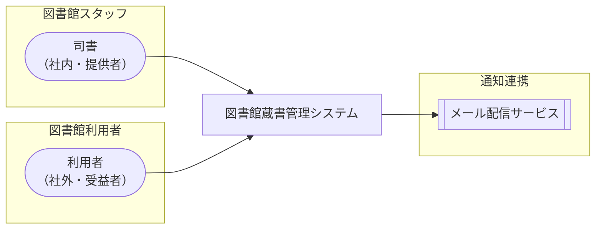

<!-- generateRdraMd.js による自動生成ファイル。手動編集しないこと。元データ: docs/requirements/rdra/*.tsv -->

# システムコンテキスト

RDRA システム価値レイヤー。システムに関わるアクターと外部システムの全体像。

> 凡例: `(丸角)` アクター / `[四角]` システム / `[[二重枠]]` 外部システム

## アクター

| アクター群 | アクター | 役割 | 社内外 | 立場 | 主担当業務 |
|---|---|---|---|---|---|
| 図書館スタッフ | 司書 | 書籍と利用者の情報を登録・編集・削除して蔵書と利用者を一元管理し、カウンターで貸出・返却・取置を登録する。利用者の問い合わせに応じて蔵書や利用状況を照会し、延滞貸出と通知送信状況を確認して連絡漏れを防ぐ。在庫状況・人気書籍・貸出統計のレポートで蔵書の利用状況を分析し図書館運営を改善する | 社内 | 提供者 | 延滞督促フロー、蔵書利用状況分析フロー |
| 図書館利用者 | 利用者 | Web画面にログインして書籍を検索・閲覧し、貸出中の書籍を予約・取消する。自分の貸出履歴・返却期限・予約状況を確認し、取置通知・返却期限リマインド・延滞督促をメールで受け取って書籍を受け取り・返却する | 社外 | 受益者 |  |

## 外部システム

| 外部システム群 | 外部システム | 役割 |
|---|---|---|
| 通知連携 | メール配信サービス | 予約取置の通知、返却期限前のリマインドメール、延滞者への督促メールを利用者へ配信する |
