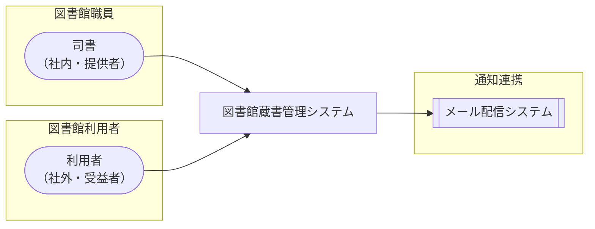

<!-- generateRdraMd.js による自動生成ファイル。手動編集しないこと。元データ: docs/requirements/rdra/*.tsv -->

# システムコンテキスト

RDRA システム価値レイヤー。システムに関わるアクターと外部システムの全体像。

> 凡例: `(丸角)` アクター / `[四角]` システム / `[[二重枠]]` 外部システム

## アクター

| アクター群 | アクター | 役割 | 社内外 | 立場 | 主担当業務 |
|---|---|---|---|---|---|
| 図書館職員 | 司書 | 蔵書・利用者の登録と管理、貸出・返却の登録、予約の受付状況と延滞状況の確認、在庫状況や貸出傾向のレポートによる蔵書運用の判断を行う | 社内 | 提供者 | 蔵書管理業務、貸出業務、蔵書分析業務 |
| 図書館利用者 | 利用者 | 書籍を検索・予約して借り、自分の貸出履歴と予約状況を確認する。返却通知・リマインド・督促のメールを受け取る | 社外 | 受益者 |  |

## 外部システム

| 外部システム群 | 外部システム | 役割 |
|---|---|---|
| 通知連携 | メール配信システム | 予約書籍の返却通知、返却期限前のリマインド、延滞時の督促のメールを利用者の連絡先へ配信する |
