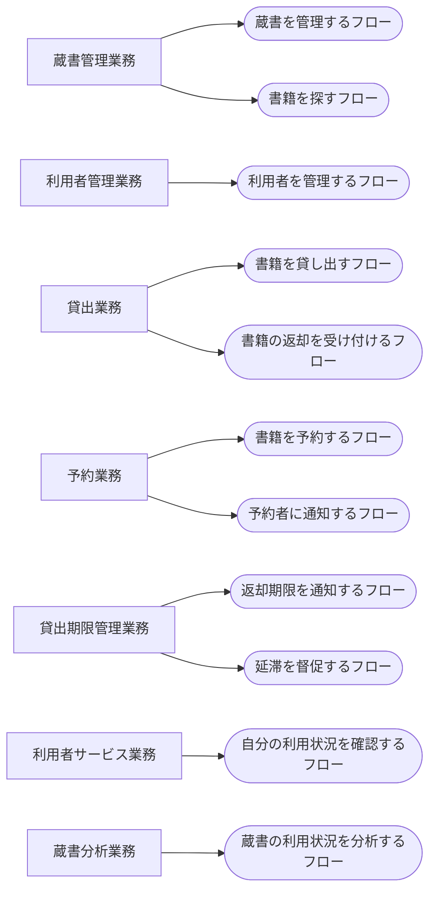

<!-- generateRdraMd.js による自動生成ファイル。手動編集しないこと。元データ: docs/requirements/rdra/*.tsv -->

# 業務構成

RDRA システム外部環境レイヤー。業務とビジネスユースケース（BUC）の構成。

> 凡例: `[四角]` 業務 / `(丸角)` BUC

## BUC 一覧

| 業務 | BUC | アクティビティ数 | UC 数 |
|---|---|---|---|
| 蔵書管理業務 | 蔵書を管理するフロー | 4 | 4 |
| 蔵書管理業務 | 書籍を探すフロー | 2 | 2 |
| 利用者管理業務 | 利用者を管理するフロー | 3 | 3 |
| 貸出業務 | 書籍を貸し出すフロー | 1 | 1 |
| 貸出業務 | 書籍の返却を受け付けるフロー | 1 | 1 |
| 予約業務 | 書籍を予約するフロー | 2 | 2 |
| 予約業務 | 予約者に通知するフロー | 1 | 1 |
| 貸出期限管理業務 | 返却期限を通知するフロー | 1 | 1 |
| 貸出期限管理業務 | 延滞を督促するフロー | 1 | 1 |
| 利用者サービス業務 | 自分の利用状況を確認するフロー | 3 | 3 |
| 蔵書分析業務 | 蔵書の利用状況を分析するフロー | 3 | 3 |
