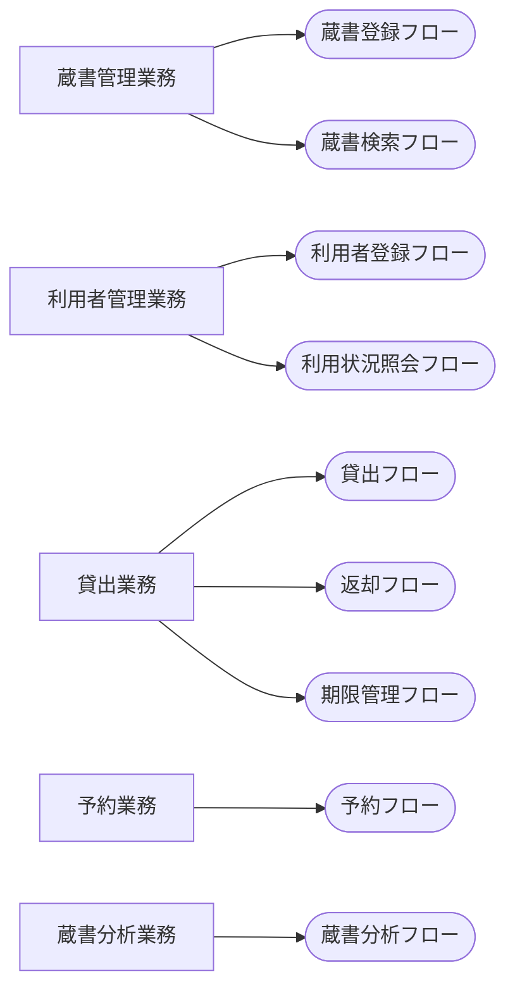

<!-- generateRdraMd.js による自動生成ファイル。手動編集しないこと。元データ: docs/requirements/rdra/*.tsv -->

# 業務構成

RDRA システム外部環境レイヤー。業務とビジネスユースケース（BUC）の構成。

> 凡例: `[四角]` 業務 / `(丸角)` BUC

## BUC 一覧

| 業務 | BUC | アクティビティ数 | UC 数 |
|---|---|---|---|
| 蔵書管理業務 | 蔵書登録フロー | 4 | 4 |
| 蔵書管理業務 | 蔵書検索フロー | 3 | 3 |
| 利用者管理業務 | 利用者登録フロー | 4 | 3 |
| 利用者管理業務 | 利用状況照会フロー | 2 | 2 |
| 貸出業務 | 貸出フロー | 4 | 3 |
| 貸出業務 | 返却フロー | 3 | 3 |
| 貸出業務 | 期限管理フロー | 3 | 3 |
| 予約業務 | 予約フロー | 3 | 3 |
| 蔵書分析業務 | 蔵書分析フロー | 3 | 3 |
