<!-- generateRdraMd.js による自動生成ファイル。手動編集しないこと。元データ: docs/requirements/rdra/*.tsv -->

# 業務フロー

RDRA システム外部環境レイヤー。BUC ごとのアクティビティの流れ。
担当（アクター）ごとのレーンに分けて表示する。

## 蔵書管理業務

### 蔵書を管理するフロー

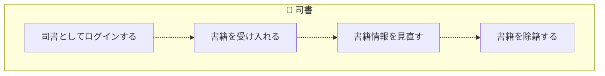

> 点線矢印は TSV の行順にもとづく推定順序（`先`/`次` 未指定のため）。

| アクティビティ | 担当 | UC | 説明 |
|---|---|---|---|
| 司書としてログインする | 司書 | 司書がログインする | 司書がWeb画面にログインし、司書の役割に応じた管理機能(蔵書・利用者管理、貸出・返却登録、レポート)を使えるようにする |
| 書籍を受け入れる | 司書 | 書籍を登録する | 司書がタイトル・著者・ISBN・出版社・ジャンル・媒体種別(未指定時は紙)を入力して書籍を登録し、登録時の書籍の状態を在庫ありにする。同じISBNの書籍は別の所蔵資料として既存の書籍情報に紐づける。タイトルが空の場合は入力エラーにする |
| 書籍情報を見直す | 司書 | 書籍情報を編集する | 司書が登録済みの書籍の出版社・ジャンル等を変更して保存し、検索結果に反映する |
| 書籍を除籍する | 司書 | 書籍を削除する | 司書が書籍を蔵書から削除する。貸出中または予約がある書籍は削除できずエラーを表示する |

### 書籍を探すフロー

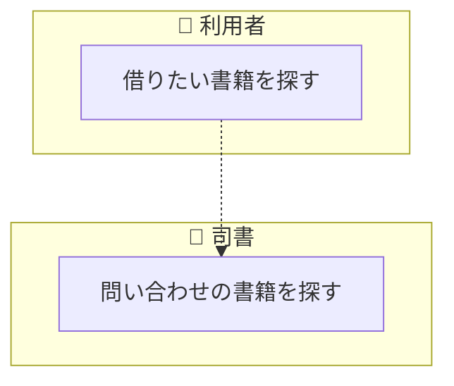

> 点線矢印は TSV の行順にもとづく推定順序（`先`/`次` 未指定のため）。

| アクティビティ | 担当 | UC | 説明 |
|---|---|---|---|
| 借りたい書籍を探す | 利用者 | 書籍を検索する | 利用者がキーワード・タイトル・著者・ISBN・ジャンルで書籍を検索し、在庫状況(貸出中・在庫あり・予約待ち)付きで結果を確認する。該当なしの場合はメッセージを表示する |
| 問い合わせの書籍を探す | 司書 | 書籍の所在を検索する | 司書が利用者の問い合わせに応じてキーワード・タイトル・著者・ISBN・ジャンルで書籍を検索し、在庫状況を確認して案内する |

## 利用者管理業務

### 利用者を管理するフロー

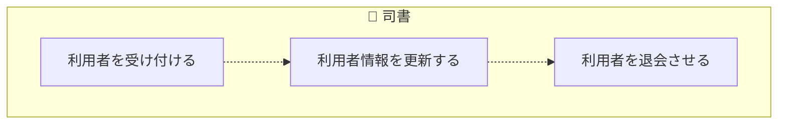

> 点線矢印は TSV の行順にもとづく推定順序（`先`/`次` 未指定のため）。

| アクティビティ | 担当 | UC | 説明 |
|---|---|---|---|
| 利用者を受け付ける | 司書 | 利用者を登録する | 司書が氏名・連絡先(メールアドレス)を入力して利用者を登録し、システムが一意の利用者番号を採番する。メールアドレスの形式が不正な場合は入力エラーにする |
| 利用者情報を更新する | 司書 | 利用者情報を編集する | 司書が利用者の連絡先等を変更して保存し、以後の通知を新しい連絡先に送るようにする |
| 利用者を退会させる | 司書 | 利用者を削除する | 司書が利用者を削除し貸出の対象外にする。貸出中の書籍がある利用者は削除できずエラーを表示する |

## 貸出業務

### 書籍を貸し出すフロー

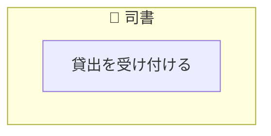

| アクティビティ | 担当 | UC | 説明 |
|---|---|---|---|
| 貸出を受け付ける | 司書 | 貸出を登録する | 司書が利用者と書籍を指定して貸出を登録し、貸出日に貸出期間を加えた返却期限を自動設定する。書籍の状態を貸出中、貸出の状態を貸出中にする。取り置き中の書籍をその利用者に貸し出す場合は予約の状態を受取済みにする。在庫ありでも本人向けの取り置き中でもない書籍は貸出できずエラーを表示する |

### 書籍の返却を受け付けるフロー

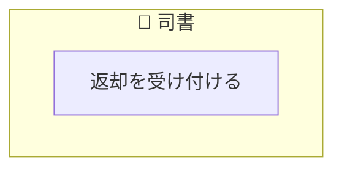

| アクティビティ | 担当 | UC | 説明 |
|---|---|---|---|
| 返却を受け付ける | 司書 | 返却を登録する | 司書が貸出中の書籍の返却を登録し、貸出に返却日を記録して貸出の状態を返却済みにする。予約が無ければ書籍の状態を在庫ありに戻し、予約があれば書籍の状態と予約順1位の予約の状態を取り置き中にする |

## 予約業務

### 書籍を予約するフロー

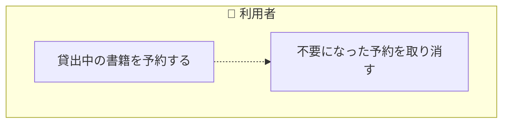

> 点線矢印は TSV の行順にもとづく推定順序（`先`/`次` 未指定のため）。

| アクティビティ | 担当 | UC | 説明 |
|---|---|---|---|
| 貸出中の書籍を予約する | 利用者 | 書籍を予約する | 利用者がWeb画面から貸出中の書籍を予約し、受付順の予約順位を得て予約の状態を待機中にする。在庫ありの書籍や同じ書籍の重複予約は受け付けない |
| 不要になった予約を取り消す | 利用者 | 予約を取り消す | 利用者が待機中の自分の予約を取り消して予約の状態を取消済みにし、後続の予約順位を1つ繰り上げて他の予約者に順番を譲る |

### 予約者に通知するフロー

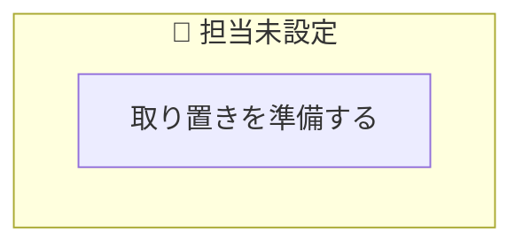

| アクティビティ | 担当 | UC | 説明 |
|---|---|---|---|
| 取り置きを準備する | 担当未設定 | 受取可能を通知する | 司書が予約のある書籍の返却を登録すると、予約順1位の利用者に受取可能メールを自動送信する。予約の無い書籍の返却では送信しない |

## 貸出期限管理業務

### 返却期限を通知するフロー

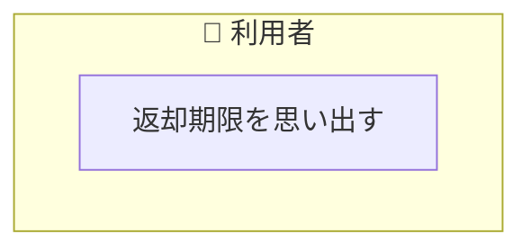

| アクティビティ | 担当 | UC | 説明 |
|---|---|---|---|
| 返却期限を思い出す | 利用者 | 返却期限をリマインドする | 定時処理で返却期限のリマインド日数前になった未返却の貸出を抽出し、利用者にリマインドメールを自動送信する。返却済みの貸出には送信しない |

### 延滞を督促するフロー

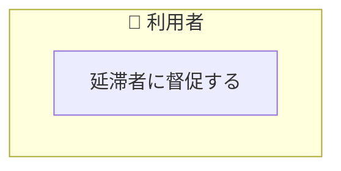

| アクティビティ | 担当 | UC | 説明 |
|---|---|---|---|
| 延滞者に督促する | 利用者 | 延滞を督促する | 定時処理で返却期限を超過した未返却の貸出の状態を延滞中にし、利用者に督促メールを自動送信する。同じ延滞に同じ日に督促メールを重複送信しない。司書の督促連絡の手間と漏れをなくす |

## 利用者サービス業務

### 自分の利用状況を確認するフロー

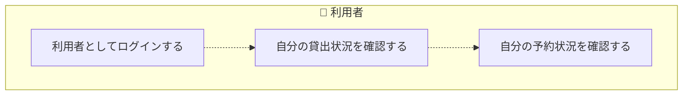

> 点線矢印は TSV の行順にもとづく推定順序（`先`/`次` 未指定のため）。

| アクティビティ | 担当 | UC | 説明 |
|---|---|---|---|
| 利用者としてログインする | 利用者 | 利用者がログインする | 利用者がWeb画面にログインし、利用者の役割に応じた機能だけを使えるようにする。司書向けの管理画面へのアクセスは拒否する |
| 自分の貸出状況を確認する | 利用者 | 貸出状況を照会する | 利用者が自分の現在の貸出を返却期限・延滞有無付きで、過去の貸出を返却日付きで確認する。他の利用者の貸出は表示しない |
| 自分の予約状況を確認する | 利用者 | 予約状況を照会する | 利用者が自分の待機中の予約を予約順位付きで、取り置き中の予約を受取可能として確認する。他の利用者の予約は表示しない |

## 蔵書分析業務

### 蔵書の利用状況を分析するフロー

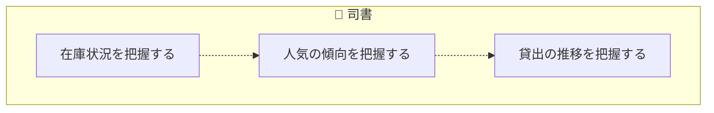

> 点線矢印は TSV の行順にもとづく推定順序（`先`/`次` 未指定のため）。

| アクティビティ | 担当 | UC | 説明 |
|---|---|---|---|
| 在庫状況を把握する | 司書 | 在庫状況レポートを確認する | 司書が書籍ごとの在庫状況(貸出中・在庫あり・予約待ち)を在庫状況別に集計・一覧表示して確認する |
| 人気の傾向を把握する | 司書 | 人気書籍ランキングを確認する | 司書が期間を指定し、貸出回数の多い順に並んだ人気書籍ランキングを確認して選書に活かす |
| 貸出の推移を把握する | 司書 | 貸出統計を確認する | 司書が集計期間単位(日・月・年)と期間を指定して貸出件数の統計を確認し、運営の判断に活かす |
