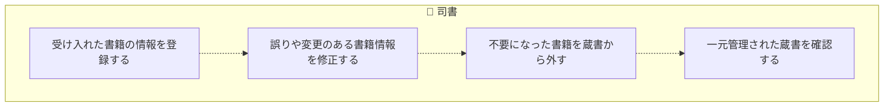
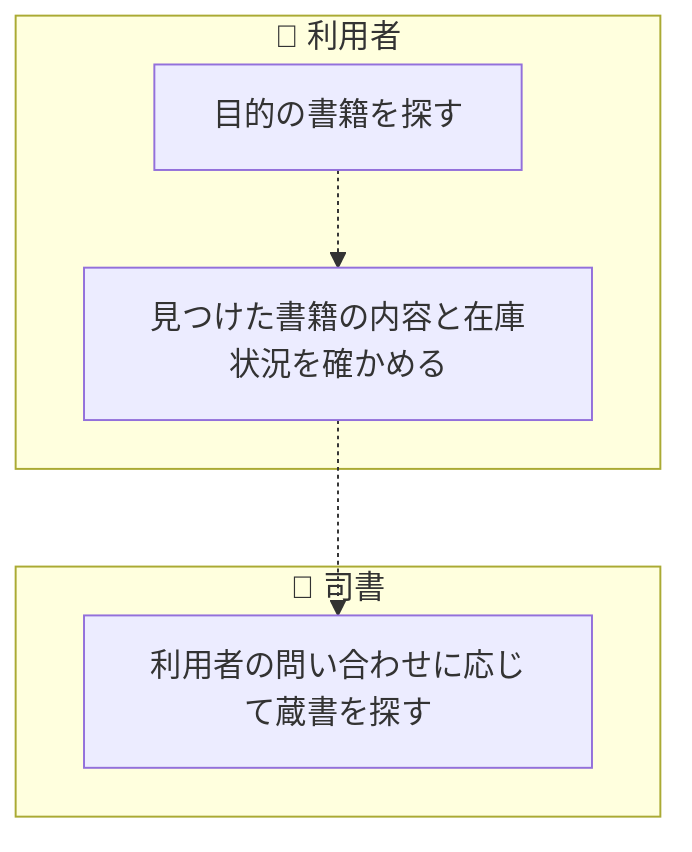
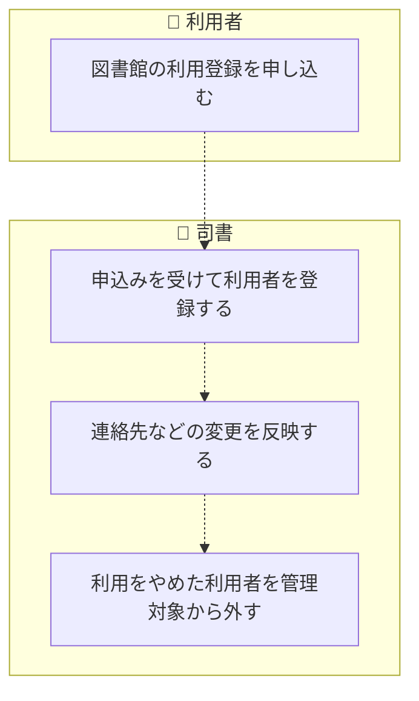
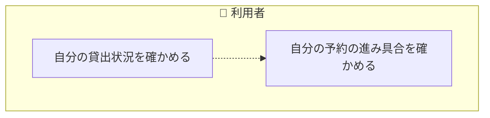
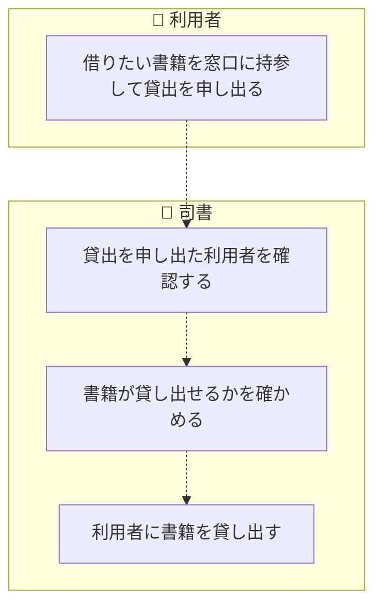
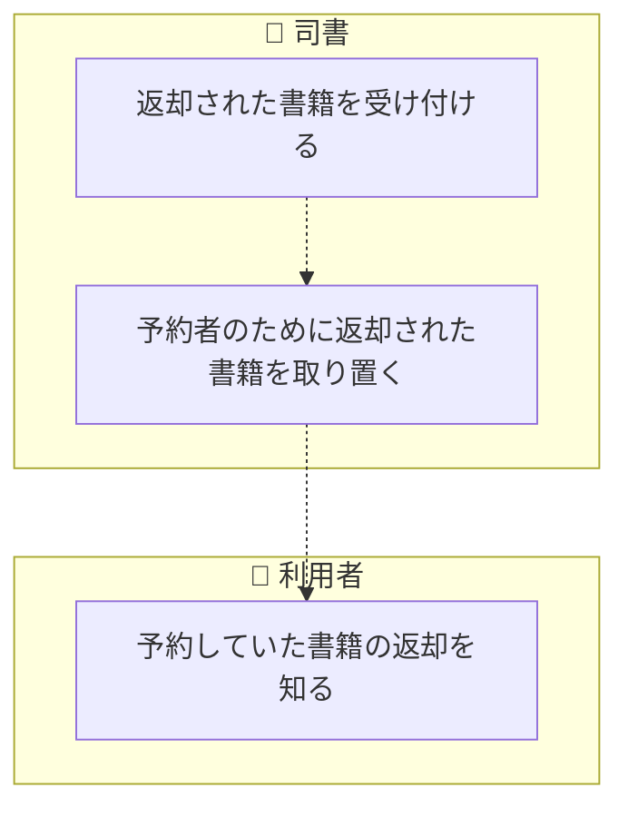
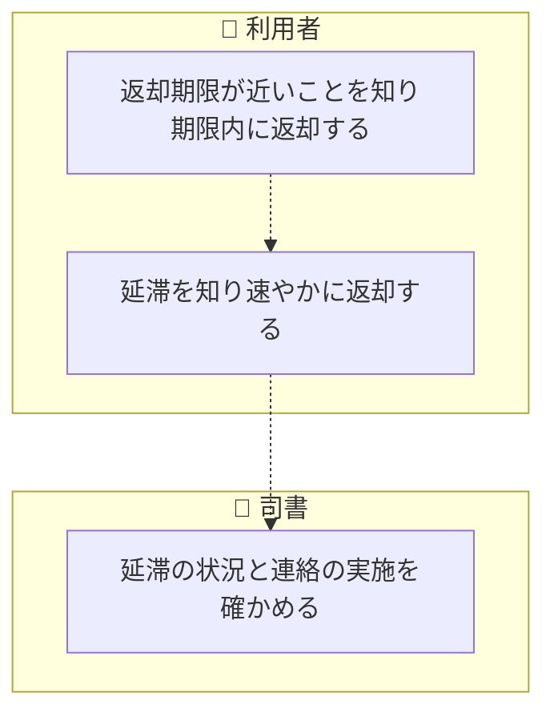
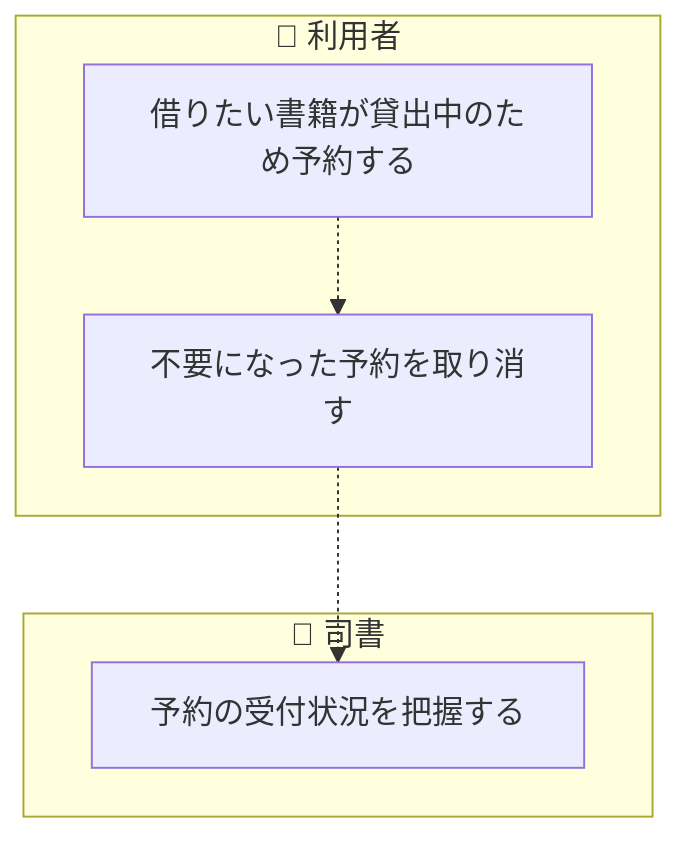
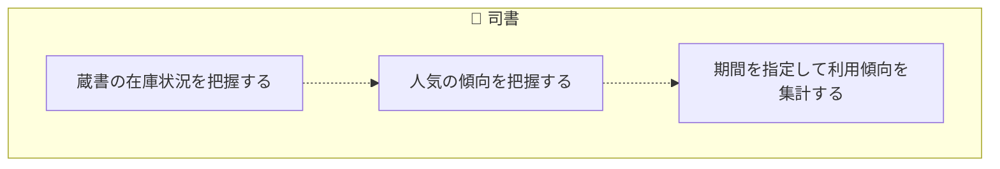

<!-- generateRdraMd.js による自動生成ファイル。手動編集しないこと。元データ: docs/requirements/rdra/*.tsv -->

# 業務フロー

RDRA システム外部環境レイヤー。BUC ごとのアクティビティの流れ。
担当（アクター）ごとのレーンに分けて表示する。

## 蔵書管理業務

### 蔵書登録フロー

> 点線矢印は TSV の行順にもとづく推定順序（`先`/`次` 未指定のため）。

| アクティビティ | 担当 | UC | 説明 |
|---|---|---|---|
| 受け入れた書籍の情報を登録する | 司書 | 書籍を登録する | 司書がタイトル・著者・ISBN・出版社・ジャンル・媒体種別を入力して書籍を蔵書として登録し、書籍状態を在庫ありにする |
| 誤りや変更のある書籍情報を修正する | 司書 | 書籍情報を編集する | 司書が登録済みの書籍情報を編集して保存し、変更後の書籍情報を蔵書一覧と検索結果に反映する |
| 不要になった書籍を蔵書から外す | 司書 | 書籍を削除する | 司書が貸出されていない書籍を削除し、蔵書一覧と検索結果に表示されないようにする。貸出中の書籍は削除できない |
| 一元管理された蔵書を確認する | 司書 | 蔵書一覧を確認する | 司書が紙台帳と表計算ファイルに代わってシステムに登録された蔵書を一覧で確認し、媒体種別と書籍状態を把握する |

### 蔵書検索フロー

> 点線矢印は TSV の行順にもとづく推定順序（`先`/`次` 未指定のため）。

| アクティビティ | 担当 | UC | 説明 |
|---|---|---|---|
| 目的の書籍を探す | 利用者 | 書籍を検索する | 利用者がキーワード・タイトル・著者・ISBN・ジャンルのいずれかを指定して書籍を検索し、条件に一致する書籍の一覧を得る |
| 見つけた書籍の内容と在庫状況を確かめる | 利用者 | 書籍の詳細を参照する | 利用者が検索結果から書籍を選び、書籍情報・媒体種別・書籍状態（在庫あり・貸出中・予約待ち）を確認する |
| 利用者の問い合わせに応じて蔵書を探す | 司書 | 蔵書を検索する | 司書が利用者の問い合わせを受けてキーワード・タイトル・著者・ISBN・ジャンルで蔵書を検索し、該当する書籍と書籍状態を案内する |

## 利用者管理業務

### 利用者登録フロー

> 点線矢印は TSV の行順にもとづく推定順序（`先`/`次` 未指定のため）。

| アクティビティ | 担当 | UC | 説明 |
|---|---|---|---|
| 図書館の利用登録を申し込む | 利用者 |  | 利用者が氏名と連絡先を司書に伝えて利用登録を申し込む。利用者自身による Web での登録は記述されていないためシステム操作は伴わない |
| 申込みを受けて利用者を登録する | 司書 | 利用者を登録する | 司書が氏名と連絡先を入力して利用者を登録し、一意の利用者番号を採番する |
| 連絡先などの変更を反映する | 司書 | 利用者情報を編集する | 司書が登録済みの利用者の氏名・連絡先を編集して保存し、変更後の連絡先を以後の通知に使えるようにする |
| 利用をやめた利用者を管理対象から外す | 司書 | 利用者を削除する | 司書が貸出中の書籍を持たない利用者を削除し、利用者一覧に表示されないようにする。貸出中の書籍を持つ利用者は削除できない |

### 利用状況照会フロー

> 点線矢印は TSV の行順にもとづく推定順序（`先`/`次` 未指定のため）。

| アクティビティ | 担当 | UC | 説明 |
|---|---|---|---|
| 自分の貸出状況を確かめる | 利用者 | 貸出履歴を照会する | 利用者が Web 画面で自分の現在の貸出と返却期限、過去の貸出を区別して確認する。他の利用者の貸出は表示しない |
| 自分の予約の進み具合を確かめる | 利用者 | 予約状況を照会する | 利用者が Web 画面で自分の予約中の書籍と現在の予約順位を確認する。他の利用者の予約は表示しない |

## 貸出業務

### 貸出フロー

> 点線矢印は TSV の行順にもとづく推定順序（`先`/`次` 未指定のため）。

| アクティビティ | 担当 | UC | 説明 |
|---|---|---|---|
| 借りたい書籍を窓口に持参して貸出を申し出る | 利用者 |  | 利用者が利用者番号と借りたい書籍を司書に提示して貸出を申し出る。貸出の登録は司書が行う |
| 貸出を申し出た利用者を確認する | 司書 | 利用者を特定する | 司書が利用者番号で登録済みの利用者を検索し、貸出の相手となる利用者を特定する |
| 書籍が貸し出せるかを確かめる | 司書 | 貸出可否を確認する | 司書が書籍の書籍状態を確認し、在庫ありの書籍か、予約待ちで予約順 1 位の利用者への貸出かを貸出可否条件で判定する |
| 利用者に書籍を貸し出す | 司書 | 貸出を登録する | 司書が利用者と書籍を指定して貸出を登録する。貸出日に貸出期間を加えた日を返却期限として自動設定し、貸出状態を貸出中、書籍状態を貸出中にする。予約者への貸出の場合は予約状態を完了にする |

### 返却フロー

> 点線矢印は TSV の行順にもとづく推定順序（`先`/`次` 未指定のため）。

| アクティビティ | 担当 | UC | 説明 |
|---|---|---|---|
| 返却された書籍を受け付ける | 司書 | 返却を登録する | 司書が返却された書籍の返却を登録し、貸出状態を返却済にする。予約がなければ書籍状態を在庫ありに、予約があれば予約待ちにする |
| 予約者のために返却された書籍を取り置く | 司書 | 予約待ちの書籍を確認する | 司書が返却登録で予約待ちになった書籍と予約順 1 位の利用者を確認し、受け取りまで書籍を取り置く |
| 予約していた書籍の返却を知る | 利用者 | 返却通知を送信する | 予約のある書籍の返却登録を契機に、予約順 1 位の利用者の連絡先へメール配信システムで返却通知メールを送信し、予約状態を通知済にして通知を記録する |

### 期限管理フロー

> 点線矢印は TSV の行順にもとづく推定順序（`先`/`次` 未指定のため）。

| アクティビティ | 担当 | UC | 説明 |
|---|---|---|---|
| 返却期限が近いことを知り期限内に返却する | 利用者 | 返却期限のリマインドを送信する | 日次の期限チェック（タイマー）で、返却期限までの日数がリマインド日数以内の未返却の貸出を抽出し、利用者の連絡先へメール配信システムでリマインドメールを 1 回だけ送信して通知を記録する |
| 延滞を知り速やかに返却する | 利用者 | 延滞の督促を送信する | 日次の期限チェック（タイマー）で、返却期限を超過した未返却の貸出の貸出状態を延滞にし、利用者の連絡先へメール配信システムで督促メールを送信して通知を記録する |
| 延滞の状況と連絡の実施を確かめる | 司書 | 延滞中の貸出を確認する | 司書が延滞状態の貸出と、リマインド・督促の送信記録を確認し、手作業による期限管理と連絡をせずに延滞状況を把握する |

## 予約業務

### 予約フロー

> 点線矢印は TSV の行順にもとづく推定順序（`先`/`次` 未指定のため）。

| アクティビティ | 担当 | UC | 説明 |
|---|---|---|---|
| 借りたい書籍が貸出中のため予約する | 利用者 | 書籍を予約する | 利用者が Web 画面で貸出中の書籍を予約する。予約可否条件で在庫ありの書籍は予約できないと判定し、受付順に予約順位を付けて予約状態を予約中にする |
| 不要になった予約を取り消す | 利用者 | 予約を取り消す | 利用者が Web 画面で自分の予約を取り消し、予約状態を取消にする。後続の予約者の予約順位を繰り上げる |
| 予約の受付状況を把握する | 司書 | 予約一覧を確認する | 司書が書籍ごとの予約と予約順位、予約状態を確認し、返却時の取り置きと予約順 1 位の利用者への貸出に備える |

## 蔵書分析業務

### 蔵書分析フロー

> 点線矢印は TSV の行順にもとづく推定順序（`先`/`次` 未指定のため）。

| アクティビティ | 担当 | UC | 説明 |
|---|---|---|---|
| 蔵書の在庫状況を把握する | 司書 | 在庫状況レポートを確認する | 司書が書籍状態（在庫あり・貸出中・予約待ち）ごとの書籍と件数を在庫状況レポートで確認する |
| 人気の傾向を把握する | 司書 | 人気書籍ランキングを確認する | 司書が貸出回数の多い順に並んだ人気書籍ランキングを確認し、蔵書の運用判断に活かす |
| 期間を指定して利用傾向を集計する | 司書 | 貸出統計を集計する | 司書が開始日と終了日を指定し、集計期間条件に従って指定期間内の貸出件数を集計した貸出統計を確認する |
