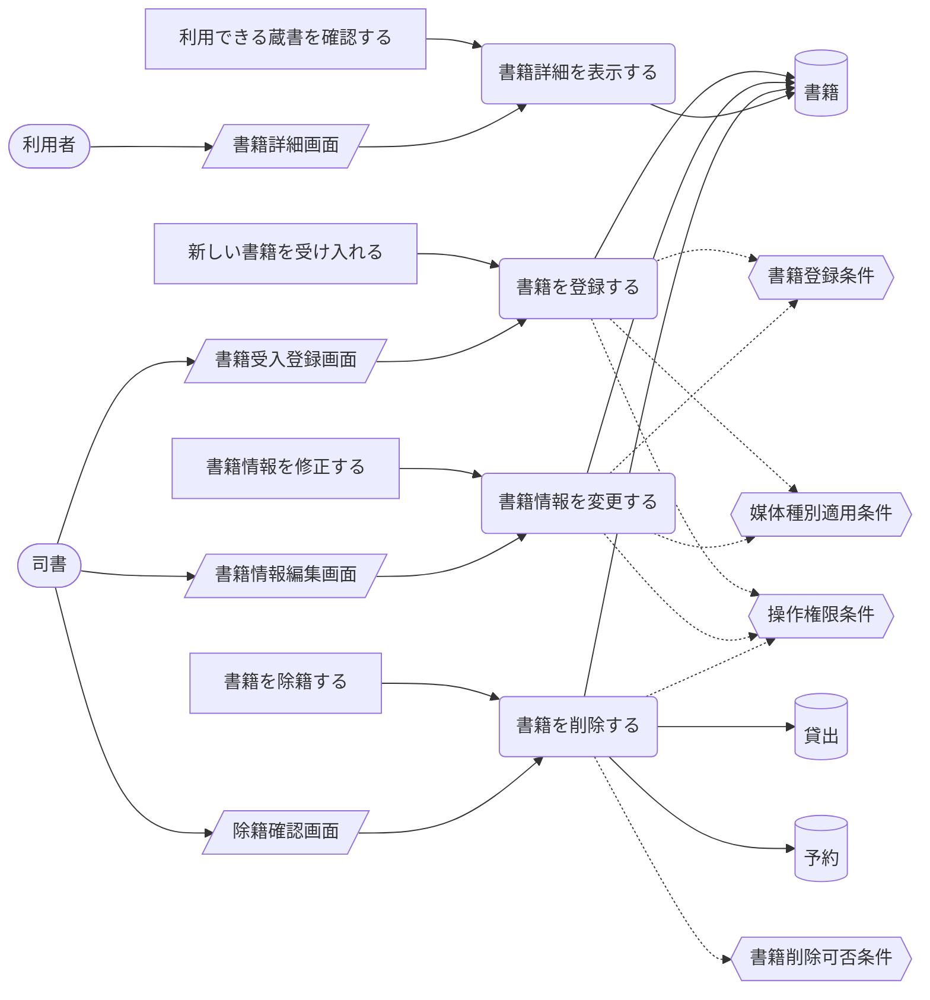
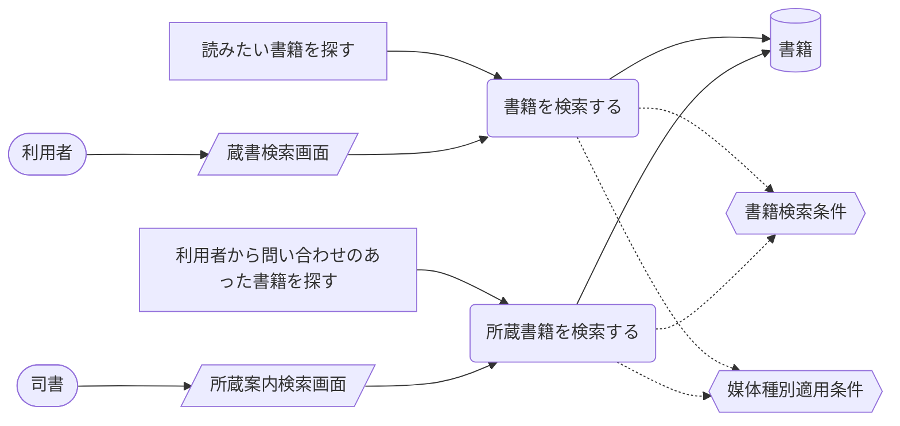
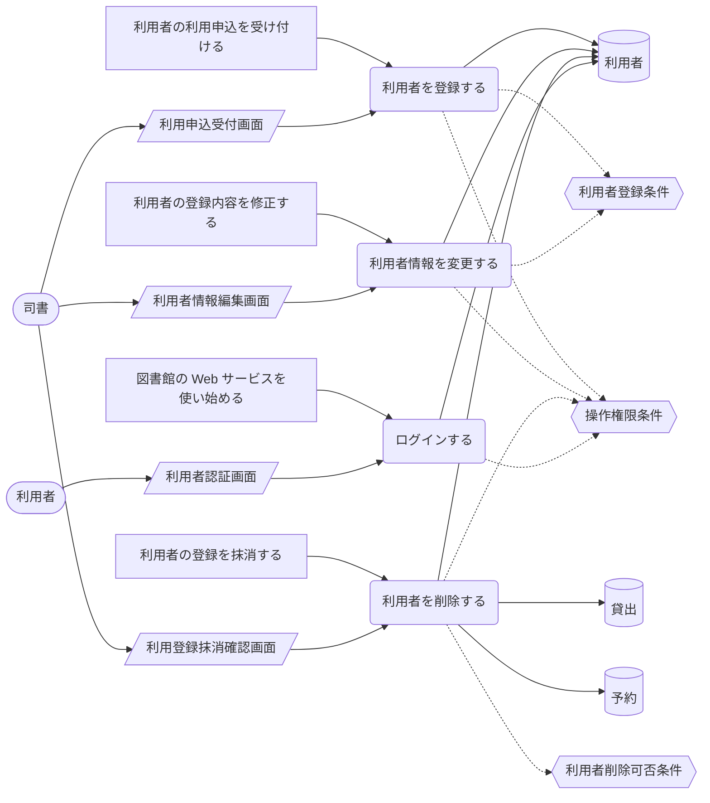
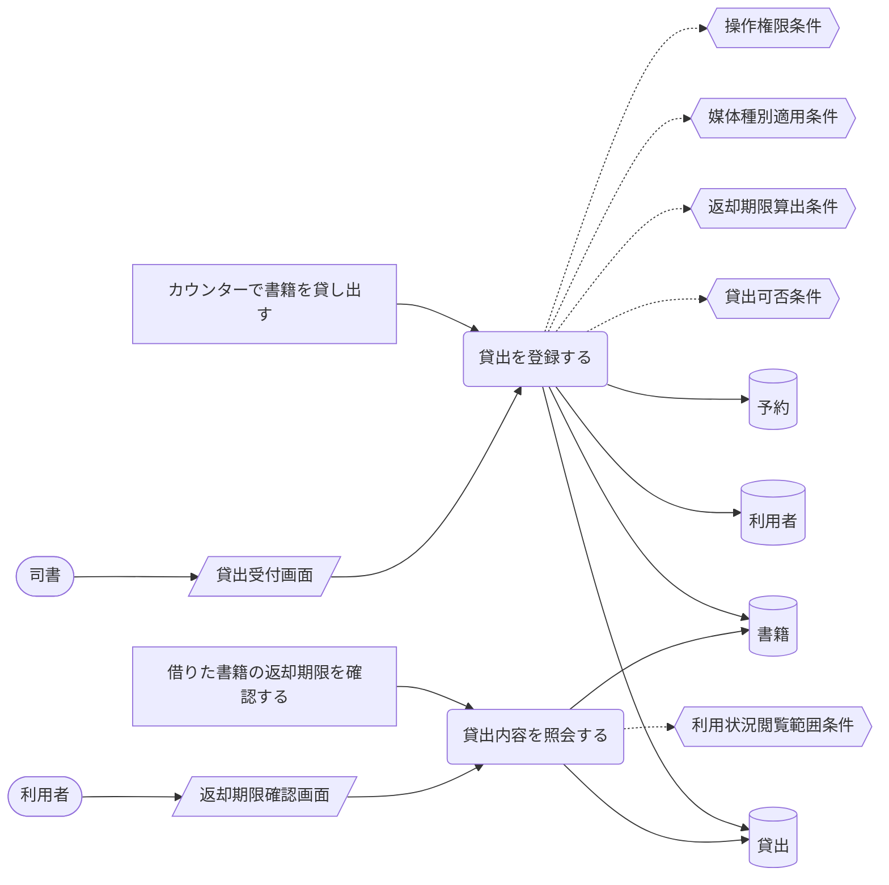
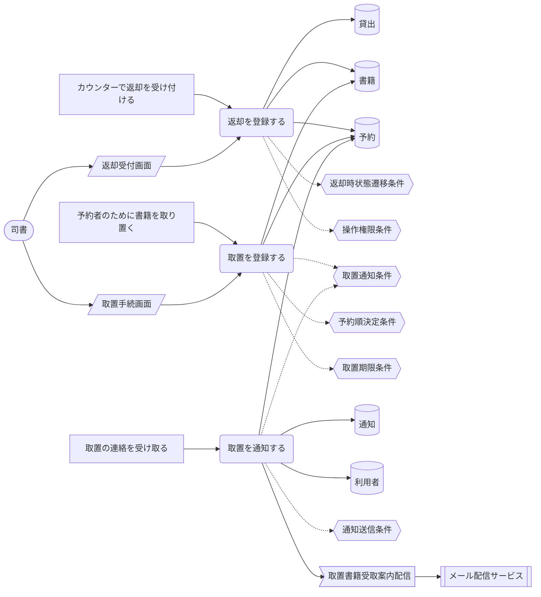
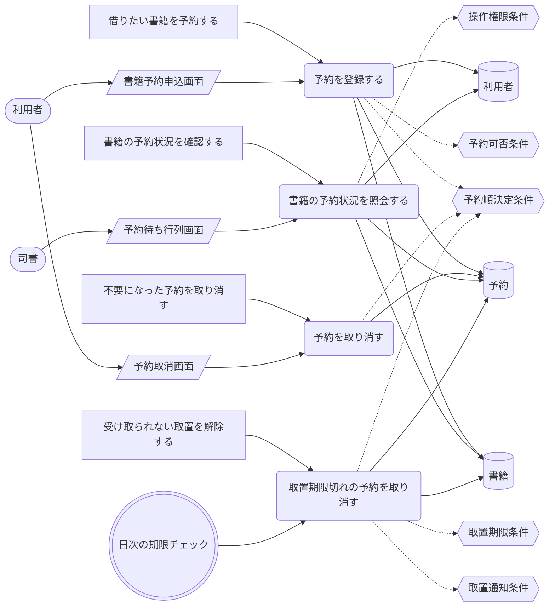
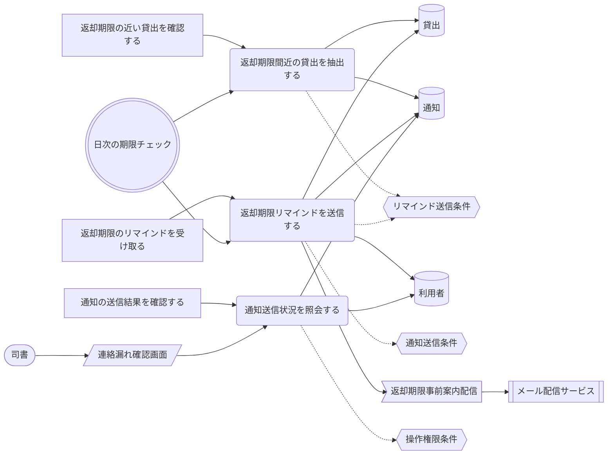
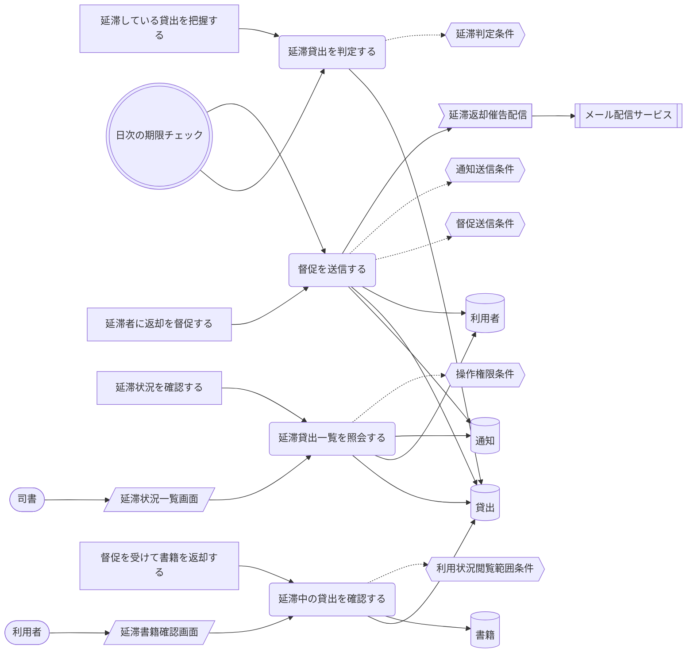
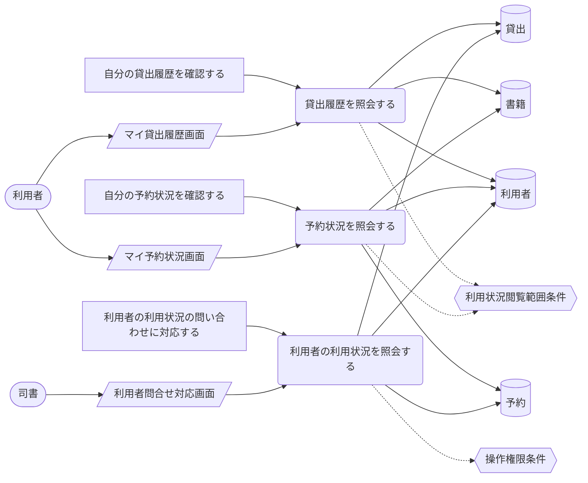
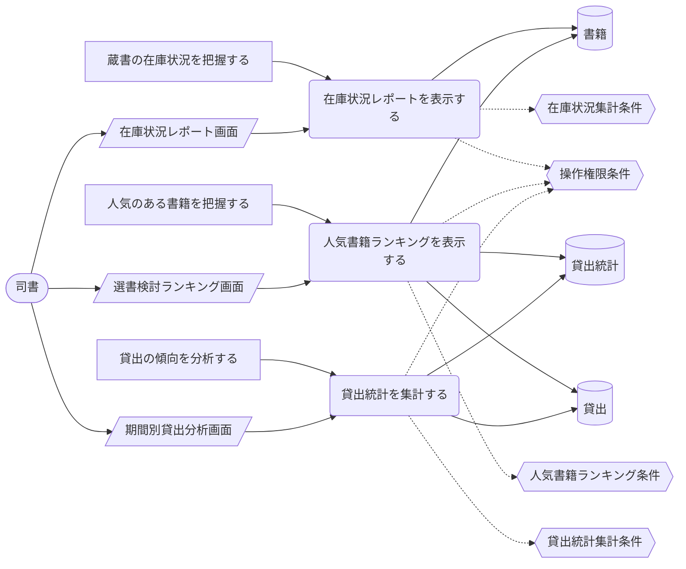

<!-- generateRdraMd.js による自動生成ファイル。手動編集しないこと。元データ: docs/requirements/rdra/*.tsv -->

# UC複合図

RDRA システム境界レイヤー。BUC ごとに、アクティビティ・UC・画面・イベント・
情報・条件・外部システムの関係を表す。

## 蔵書管理業務

### 蔵書管理フロー

> 凡例: `(丸角)` アクター・UC / `[四角]` アクティビティ / `[/斜め/]` 画面 / `[(円柱)]` 情報 / `{{六角}}` 条件 / `>旗]` イベント / `[[二重枠]]` 外部システム。点線は条件参照。

| UC | アクティビティ | 画面 | 情報 | 条件 | イベント | 説明 |
|---|---|---|---|---|---|---|
| 書籍を登録する | 新しい書籍を受け入れる | 書籍受入登録画面 | 書籍 | 書籍登録条件、媒体種別適用条件、操作権限条件 |  | 司書がタイトル、著者、ISBN、出版社、ジャンル、媒体種別（紙・電子）を入力して書籍を登録する。ISBNが同一の書籍は重複登録できない。登録した書籍の書籍状態は在庫ありとなる |
| 書籍情報を変更する | 書籍情報を修正する | 書籍情報編集画面 | 書籍 | 書籍登録条件、媒体種別適用条件、操作権限条件 |  | 司書が登録済みの書籍のタイトル、著者、ISBN、出版社、ジャンル、媒体種別を編集して保存する |
| 書籍を削除する | 書籍を除籍する | 除籍確認画面 | 書籍、貸出、予約 | 書籍削除可否条件、操作権限条件 |  | 司書が不要になった書籍を削除する。貸出中または予約待ち（取置）の書籍は削除できない。削除した書籍の書籍状態は削除済みとなり、検索結果に表示されなくなる |
| 書籍詳細を表示する | 利用できる蔵書を確認する | 書籍詳細画面 | 書籍 |  |  | 利用者が一元管理された蔵書から書籍の詳細（タイトル、著者、ISBN、出版社、ジャンル、媒体種別）と書籍状態を確認する |

### 書籍検索フロー

> 凡例: `(丸角)` アクター・UC / `[四角]` アクティビティ / `[/斜め/]` 画面 / `[(円柱)]` 情報 / `{{六角}}` 条件 / `>旗]` イベント / `[[二重枠]]` 外部システム。点線は条件参照。

| UC | アクティビティ | 画面 | 情報 | 条件 | イベント | 説明 |
|---|---|---|---|---|---|---|
| 書籍を検索する | 読みたい書籍を探す | 蔵書検索画面 | 書籍 | 書籍検索条件、媒体種別適用条件 |  | 利用者がキーワード、タイトル、著者、ISBN、ジャンルを条件に書籍を検索し、条件に一致する書籍を媒体種別と在庫状況付きで一覧表示する |
| 所蔵書籍を検索する | 利用者から問い合わせのあった書籍を探す | 所蔵案内検索画面 | 書籍 | 書籍検索条件、媒体種別適用条件 |  | 司書が利用者の問い合わせを受け、キーワード、タイトル、著者、ISBN、ジャンルで蔵書を検索し、書籍の所在と在庫状況を案内する |

## 利用者管理業務

### 利用者管理フロー

> 凡例: `(丸角)` アクター・UC / `[四角]` アクティビティ / `[/斜め/]` 画面 / `[(円柱)]` 情報 / `{{六角}}` 条件 / `>旗]` イベント / `[[二重枠]]` 外部システム。点線は条件参照。

| UC | アクティビティ | 画面 | 情報 | 条件 | イベント | 説明 |
|---|---|---|---|---|---|---|
| 利用者を登録する | 利用者の利用申込を受け付ける | 利用申込受付画面 | 利用者 | 利用者登録条件、操作権限条件 |  | 司書が氏名と連絡先（メールアドレス等）を入力して利用者を登録する。一意の利用者番号を付与し、利用者状態は有効となる |
| 利用者情報を変更する | 利用者の登録内容を修正する | 利用者情報編集画面 | 利用者 | 利用者登録条件、操作権限条件 |  | 司書が登録済みの利用者の氏名や連絡先を編集して保存する |
| 利用者を削除する | 利用者の登録を抹消する | 利用登録抹消確認画面 | 利用者、貸出、予約 | 利用者削除可否条件、操作権限条件 |  | 司書が利用者を削除する。貸出中の書籍、または予約中・取置中の予約を持つ利用者は削除できない。削除した利用者の利用者状態は削除済みとなり、利用者一覧に表示されなくなる |
| ログインする | 図書館の Web サービスを使い始める | 利用者認証画面 | 利用者 | 操作権限条件 |  | 利用者が利用者番号で Web 画面にログインし、予約や自分の利用状況の確認などのサービスを利用できるようにする。有効な利用者だけがログインできる |

## 貸出業務

### 貸出フロー

> 凡例: `(丸角)` アクター・UC / `[四角]` アクティビティ / `[/斜め/]` 画面 / `[(円柱)]` 情報 / `{{六角}}` 条件 / `>旗]` イベント / `[[二重枠]]` 外部システム。点線は条件参照。

| UC | アクティビティ | 画面 | 情報 | 条件 | イベント | 説明 |
|---|---|---|---|---|---|---|
| 貸出を登録する | カウンターで書籍を貸し出す | 貸出受付画面 | 貸出、書籍、利用者、予約 | 貸出可否条件、返却期限算出条件、媒体種別適用条件、操作権限条件 |  | 司書が利用者番号と書籍を指定して貸出を登録する。貸出可否条件（在庫ありまたは本人の取置中の書籍であること等）を満たさない場合は登録できない。貸出日と貸出期間から返却期限を自動設定し、書籍状態を貸出中、貸出状態を貸出中にする。取置中の予約に基づく貸出では予約状態を受取済みにする。登録した貸出は在庫状況・人気書籍・貸出統計の集計対象となる貸出実績として蓄積する |
| 貸出内容を照会する | 借りた書籍の返却期限を確認する | 返却期限確認画面 | 貸出、書籍 | 利用状況閲覧範囲条件 |  | 利用者が現在借りている書籍と自動設定された返却期限を Web 画面で確認する |

### 返却フロー

> 凡例: `(丸角)` アクター・UC / `[四角]` アクティビティ / `[/斜め/]` 画面 / `[(円柱)]` 情報 / `{{六角}}` 条件 / `>旗]` イベント / `[[二重枠]]` 外部システム。点線は条件参照。

| UC | アクティビティ | 画面 | 情報 | 条件 | イベント | 説明 |
|---|---|---|---|---|---|---|
| 返却を登録する | カウンターで返却を受け付ける | 返却受付画面 | 貸出、書籍、予約 | 返却時状態遷移条件、操作権限条件 |  | 司書が返却された書籍の返却を登録する。貸出に返却日を記録し、貸出状態を返却済みにする。予約がなければ書籍状態を在庫ありに、予約があれば予約待ち（取置）にする。返却の記録は貸出実績として集計対象に反映される |
| 取置を登録する | 予約者のために書籍を取り置く | 取置手続画面 | 予約、書籍 | 取置通知条件、予約順決定条件、取置期限条件 |  | 予約のある書籍の返却を契機に、予約順 1 位の予約を取置中にし、取置開始日と取置期限を設定する |
| 取置を通知する | 取置の連絡を受け取る |  | 通知、予約、利用者 | 取置通知条件、通知送信条件 | 取置書籍受取案内配信 | 取置の登録を契機に、予約順 1 位の利用者にだけ、取置された書籍と取置期限をメール配信サービス経由でメール通知する。通知状態は送信待ちから送信済みまたは送信失敗となる |

### 予約フロー

> 凡例: `(丸角)` アクター・UC / `[四角]` アクティビティ / `[/斜め/]` 画面 / `[(円柱)]` 情報 / `{{六角}}` 条件 / `>旗]` イベント / `[[二重枠]]` 外部システム。点線は条件参照。

| UC | アクティビティ | 画面 | 情報 | 条件 | イベント | 説明 |
|---|---|---|---|---|---|---|
| 予約を登録する | 借りたい書籍を予約する | 書籍予約申込画面 | 予約、書籍、利用者 | 予約可否条件、予約順決定条件 |  | ログインした利用者が貸出中の書籍を予約する。予約可否条件（書籍が貸出中または予約待ち（取置）であり重複予約でないこと）を満たさない書籍は予約できない。予約は先着順の予約順付きで登録され、予約状態は予約中となる |
| 予約を取り消す | 不要になった予約を取り消す | 予約取消画面 | 予約 | 予約順決定条件 |  | 利用者が自分の予約中または取置中の予約を取り消す。予約状態は取消済みとなり、後続の予約者の予約順が繰り上がる |
| 書籍の予約状況を照会する | 書籍の予約状況を確認する | 予約待ち行列画面 | 予約、書籍、利用者 | 操作権限条件 |  | 司書が書籍ごとの予約者と予約順、予約状態を確認し、取置や貸出の手続きに備える |
| 取置期限切れの予約を取り消す | 受け取られない取置を解除する |  | 予約、書籍 | 予約順決定条件、取置通知条件、取置期限条件 |  | タイマー（日次の期限チェック）起動で、取置期限を過ぎても受け取られない取置中の予約を取消済みにする。次の予約者がいれば取置を登録し、いなければ書籍状態を在庫ありに戻す |

### 返却期限通知フロー

> 凡例: `(丸角)` アクター・UC / `[四角]` アクティビティ / `[/斜め/]` 画面 / `[(円柱)]` 情報 / `{{六角}}` 条件 / `>旗]` イベント / `[[二重枠]]` 外部システム。点線は条件参照。

| UC | アクティビティ | 画面 | 情報 | 条件 | イベント | 説明 |
|---|---|---|---|---|---|---|
| 返却期限間近の貸出を抽出する | 返却期限の近い貸出を確認する |  | 貸出、通知 | リマインド送信条件 |  | タイマー（日次の期限チェック）起動で、リマインド送信条件（返却期限まで所定日数）に該当する未返却の貸出を抽出し、リマインドの送信対象となる通知を送信待ちで作成する |
| 返却期限リマインドを送信する | 返却期限のリマインドを受け取る |  | 通知、貸出、利用者 | リマインド送信条件、通知送信条件 | 返却期限事前案内配信 | タイマー（日次の期限チェック）起動で、抽出した貸出の利用者に、書籍と返却期限を記載したリマインドメールをメール配信サービス経由で自動送信する。通知状態は送信待ちから送信済みまたは送信失敗となる |
| 通知送信状況を照会する | 通知の送信結果を確認する | 連絡漏れ確認画面 | 通知、利用者 | 操作権限条件 |  | 司書がリマインド・督促・取置通知の送信状況（送信待ち、送信済み、送信失敗）を確認し、送信失敗の利用者への連絡漏れを防ぐ |

### 延滞督促フロー

> 凡例: `(丸角)` アクター・UC / `[四角]` アクティビティ / `[/斜め/]` 画面 / `[(円柱)]` 情報 / `{{六角}}` 条件 / `>旗]` イベント / `[[二重枠]]` 外部システム。点線は条件参照。

| UC | アクティビティ | 画面 | 情報 | 条件 | イベント | 説明 |
|---|---|---|---|---|---|---|
| 延滞貸出を判定する | 延滞している貸出を把握する |  | 貸出 | 延滞判定条件 |  | タイマー（日次の期限チェック）起動で、延滞判定条件（返却期限を超過した未返却）に該当する貸出の貸出状態を延滞にする |
| 督促を送信する | 延滞者に返却を督促する |  | 通知、貸出、利用者 | 督促送信条件、通知送信条件 | 延滞返却催告配信 | タイマー（日次の期限チェック）起動で、延滞となった貸出の利用者に、書籍と返却期限を記載した督促メールをメール配信サービス経由で自動送信する。通知状態は送信待ちから送信済みまたは送信失敗となる |
| 延滞貸出一覧を照会する | 延滞状況を確認する | 延滞状況一覧画面 | 貸出、利用者、通知 | 操作権限条件 |  | 司書が延滞中の貸出と利用者、延滞日数、督促の送信状況を一覧で確認する |
| 延滞中の貸出を確認する | 督促を受けて書籍を返却する | 延滞書籍確認画面 | 貸出、書籍 | 利用状況閲覧範囲条件 |  | 利用者が延滞中の書籍と返却期限を Web 画面で確認し、書籍を返却する |

### 利用状況確認フロー

> 凡例: `(丸角)` アクター・UC / `[四角]` アクティビティ / `[/斜め/]` 画面 / `[(円柱)]` 情報 / `{{六角}}` 条件 / `>旗]` イベント / `[[二重枠]]` 外部システム。点線は条件参照。

| UC | アクティビティ | 画面 | 情報 | 条件 | イベント | 説明 |
|---|---|---|---|---|---|---|
| 貸出履歴を照会する | 自分の貸出履歴を確認する | マイ貸出履歴画面 | 貸出、書籍、利用者 | 利用状況閲覧範囲条件 |  | ログインした利用者が自分の過去と現在の貸出を返却期限付きで一覧表示する。他の利用者の貸出は表示しない |
| 予約状況を照会する | 自分の予約状況を確認する | マイ予約状況画面 | 予約、書籍、利用者 | 利用状況閲覧範囲条件 |  | ログインした利用者が自分の予約中の書籍と予約順、予約状態を一覧表示する。他の利用者の予約は表示しない |
| 利用者の利用状況を照会する | 利用者の利用状況の問い合わせに対応する | 利用者問合せ対応画面 | 利用者、貸出、予約 | 操作権限条件 |  | 司書が利用者番号を指定して、その利用者の貸出と予約の状況を確認する |

## 蔵書分析業務

### 蔵書利用状況分析フロー

> 凡例: `(丸角)` アクター・UC / `[四角]` アクティビティ / `[/斜め/]` 画面 / `[(円柱)]` 情報 / `{{六角}}` 条件 / `>旗]` イベント / `[[二重枠]]` 外部システム。点線は条件参照。

| UC | アクティビティ | 画面 | 情報 | 条件 | イベント | 説明 |
|---|---|---|---|---|---|---|
| 在庫状況レポートを表示する | 蔵書の在庫状況を把握する | 在庫状況レポート画面 | 書籍 | 在庫状況集計条件、操作権限条件 |  | 司書が書籍状態（貸出中、在庫あり、予約待ち）ごとの書籍と件数を確認する |
| 人気書籍ランキングを表示する | 人気のある書籍を把握する | 選書検討ランキング画面 | 貸出統計、貸出、書籍 | 人気書籍ランキング条件、操作権限条件 |  | 司書が期間内の貸出回数の多い順に書籍を並べたランキングを確認し、選書に役立てる |
| 貸出統計を集計する | 貸出の傾向を分析する | 期間別貸出分析画面 | 貸出統計、貸出 | 貸出統計集計条件、操作権限条件 |  | 司書が開始日と終了日の集計期間を指定し、期間内の貸出件数を集計して表示する |
