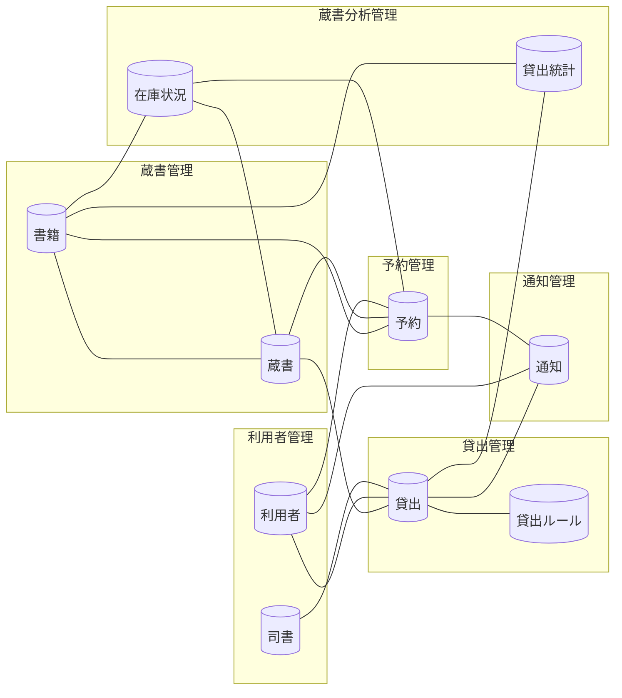

<!-- generateRdraMd.js による自動生成ファイル。手動編集しないこと。元データ: docs/requirements/rdra/*.tsv -->

# 情報モデル

RDRA システム内部レイヤー。コンテキストごとの情報と情報間の関連。

> 凡例: `[(円柱)]` 情報 / `[四角]` 情報.tsv 未定義の参照。実線は関連情報。

## 情報一覧

| コンテキスト | 情報 | 属性 | 状態モデル | バリエーション | 説明 |
|---|---|---|---|---|---|
| 蔵書管理 | 書籍 | ISBN、タイトル、著者、出版社、ジャンル、媒体種別、登録日 |  | ジャンル、媒体種別、検索条件種別 | タイトル・著者・ISBN・出版社・ジャンル・媒体種別(紙・電子、未指定時は紙)を持つ書誌情報。紙台帳と表計算ファイルに分散した蔵書情報を一元管理する。UC「書籍を登録する」「書籍情報を編集する」「書籍を削除する」で操作し、UC「書籍を検索する」「書籍の所在を検索する」で検索条件種別により絞り込む対象になる。条件「書籍登録入力チェック」でタイトル必須・媒体種別の既定値・同じISBNの所蔵資料の紐づけを判定し、条件「書籍検索条件」で検索する。同じISBNの所蔵資料は複数の蔵書として紐づく |
| 蔵書管理 | 蔵書 | 蔵書ID、ISBN、書籍の状態、受入日 | 書籍の状態 |  | 図書館が所蔵する個々の資料(同じISBNでも複数冊を別管理)。書籍情報と紐づき、書籍の状態(在庫あり・貸出中・取り置き中)を保持する。UC「書籍を登録する」で在庫ありになり、UC「貸出を登録する」「返却を登録する」で状態が遷移し、UC「書籍を削除する」で管理対象外になる。条件「書籍削除可否」「貸出可否」「予約可否」「返却後の書籍状態決定」「在庫状況区分判定」の判断材料となり、検索結果の在庫状況表示に使う |
| 利用者管理 | 利用者 | 利用者番号、氏名、メールアドレス、ログインID、利用者区分、登録日 |  | 利用者区分 | システムが一意に採番する利用者番号で識別される利用者の氏名・連絡先(メールアドレス)。UC「利用者を登録する」「利用者情報を編集する」「利用者を削除する」で司書が管理し、UC「利用者がログインする」で本人を認証する。貸出・予約の相手を特定し、メール配信サービスで送る各種通知の送付先になる。条件「利用者登録入力チェック」「利用者削除可否」「操作権限」「本人情報参照制限」の判断に使い、自分の貸出・予約状況だけを参照させる |
| 利用者管理 | 司書 | 職員ID、氏名、ログインID、利用者区分 |  | 利用者区分 | 図書館の管理機能を操作する職員のアカウント。UC「司書がログインする」で認証し、条件「操作権限」で利用者区分(役割)により蔵書・利用者管理、貸出・返却登録、レポートの操作を司書だけに許可する。貸出・返却の登録者として貸出に記録する |
| 貸出管理 | 貸出 | 貸出ID、利用者番号、蔵書ID、貸出日、返却期限、返却日、貸出の状態、登録した司書 | 貸出の状態 |  | どの利用者にどの蔵書をいつ貸し出したかの記録。UC「貸出を登録する」で貸出中になり、条件「返却期限算出」により貸出日に貸出ルールの貸出期間を加えた返却期限を設定する。UC「返却を登録する」で返却日を記録して返却済みにし、UC「延滞を督促する」で条件「延滞判定」により延滞中にする。条件「貸出可否」「利用者削除可否」「リマインド対象判定」の判断材料となり、UC「返却期限をリマインドする」の抽出対象、UC「貸出状況を照会する」の利用者の貸出履歴表示、貸出統計の元データに使う |
| 貸出管理 | 貸出ルール | 貸出期間(日数)、リマインド日数、適用開始日 |  |  | 貸出期間・返却期限のリマインド日数など貸出運用の設定値。条件「返却期限算出」で返却期限の自動算出に、条件「リマインド対象判定」でリマインド送信日の判定に使う |
| 予約管理 | 予約 | 予約ID、利用者番号、ISBN、取り置き対象の蔵書ID、予約日時、予約順位、予約の状態、取り置き開始日 | 予約の状態 |  | 貸出中の書籍に対する利用者の予約記録。UC「書籍を予約する」で条件「予約可否」「予約順位付与」により受付順の予約順位を付けて待機中にする。UC「予約を取り消す」で条件「予約取消可否」により取消済みにして後続の予約順位を繰り上げる。UC「返却を登録する」で条件「返却後の書籍状態決定」により予約順1位を取り置き中にし、UC「貸出を登録する」で受取済みにする。UC「予約状況を照会する」で本人の予約だけを表示し、同じ利用者による同じ書籍の重複予約の判定にも使う |
| 通知管理 | 通知 | 通知ID、通知種別、対象の貸出ID、対象の予約ID、利用者番号、宛先メールアドレス、送信日時、送信結果 | 通知の状態 | 通知種別 | 利用者へメール配信サービス経由で送信した受取可能通知・返却期限リマインド・延滞督促のメール記録。UC「受取可能を通知する」で条件「予約者通知要否」、UC「返却期限をリマインドする」で条件「リマインド対象判定」、UC「延滞を督促する」で条件「督促重複抑止」により送信対象を決める。通知種別・対象の貸出または予約・送信日を記録して同日の重複送信を防ぎ、通知漏れを無くす |
| 蔵書分析管理 | 在庫状況 | 集計日時、ISBN、在庫状況区分、蔵書数、貸出中数、在庫あり数、予約待ち数 |  | 在庫状況区分 | 書籍ごとの貸出中・在庫あり・予約待ちの集計結果。蔵書の書籍の状態と予約から条件「在庫状況区分判定」で集計し、UC「在庫状況レポートを確認する」で司書が蔵書の運用状況を一覧で把握するために使う |
| 蔵書分析管理 | 貸出統計 | 集計期間単位、集計期間(開始日・終了日)、ISBN、貸出件数、貸出回数順位 |  | 集計期間単位 | 指定期間(日・月・年)ごとの貸出件数や書籍別の貸出回数の集計結果。蓄積した貸出記録から条件「人気書籍ランキング算出」「貸出統計集計」で集計し、UC「人気書籍ランキングを確認する」「貸出統計を確認する」で人気の傾向や期間別の利用傾向を把握して選書や運営の判断に活かす |
