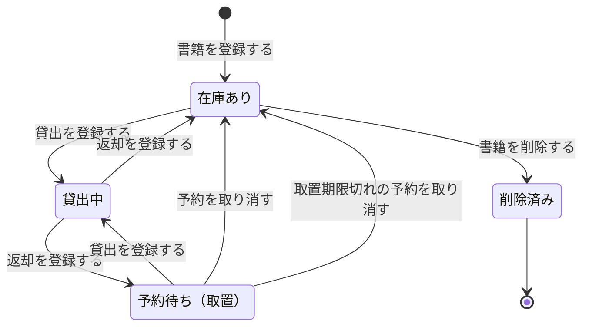
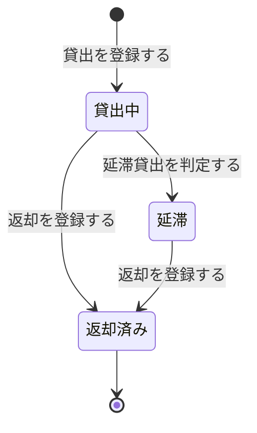
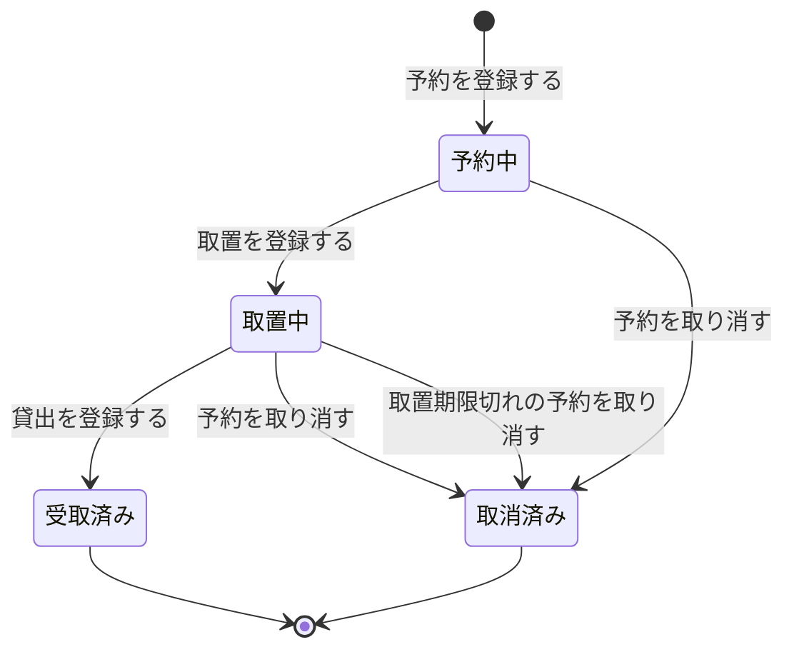
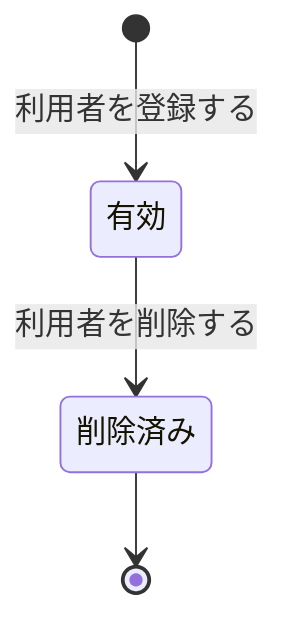
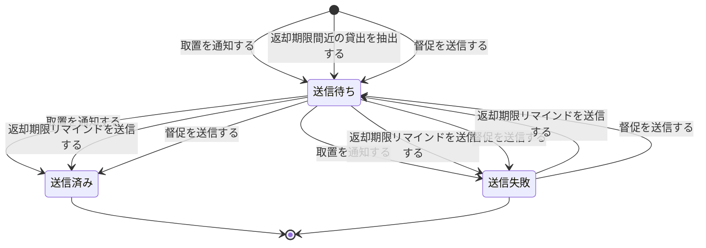

<!-- generateRdraMd.js による自動生成ファイル。手動編集しないこと。元データ: docs/requirements/rdra/*.tsv -->

# 状態モデル

RDRA システム内部レイヤー。状態モデルごとの状態遷移。遷移ラベルは UC。

## 書籍状態（蔵書管理）

| 状態 | 遷移UC | 遷移先状態 | 説明 |
|---|---|---|---|
|  | 書籍を登録する | 在庫あり | 書籍の貸出可否と在庫状況を把握するために必要。司書が書籍を登録すると在庫ありになる |
| 在庫あり | 貸出を登録する | 貸出中 | 司書が在庫ありの書籍の貸出を登録すると貸出中になる。一冊の書籍は同時に一人にしか貸し出さない |
| 貸出中 | 返却を登録する | 在庫あり | 司書が返却を登録し、その書籍に予約がない場合は在庫ありに戻る |
| 貸出中 | 返却を登録する | 予約待ち（取置） | 司書が返却を登録し、その書籍に予約がある場合は予約順1位の利用者のために予約待ち（取置）になる |
| 予約待ち（取置） | 貸出を登録する | 貸出中 | 取置された書籍を予約者へ貸し出すと貸出中になる |
| 予約待ち（取置） | 予約を取り消す | 在庫あり | 利用者が取置中の予約を取り消し、次の予約者がいない場合は在庫ありに戻る |
| 予約待ち（取置） | 取置期限切れの予約を取り消す | 在庫あり | 取置期限切れで取置中の予約が取り消され、次の予約者がいない場合は在庫ありに戻る |
| 在庫あり | 書籍を削除する | 削除済み | 貸出中でない書籍を司書が削除すると削除済みになる。貸出中・予約待ち（取置）の書籍は削除しない |
| 削除済み |  |  | 削除済みの書籍は検索や貸出の対象外となり状態遷移を終える |

## 貸出状態（貸出管理）

| 状態 | 遷移UC | 遷移先状態 | 説明 |
|---|---|---|---|
|  | 貸出を登録する | 貸出中 | 貸出期限の管理と延滞者への督促のために必要。司書が貸出を登録すると返却期限が自動設定され貸出中になる |
| 貸出中 | 延滞貸出を判定する | 延滞 | 日次の期限チェックで返却期限を超過した未返却の貸出は延滞となり督促メールを送信する |
| 貸出中 | 返却を登録する | 返却済み | 返却期限内に司書が返却を登録すると返却日が記録され返却済みになる |
| 延滞 | 返却を登録する | 返却済み | 延滞中の貸出に対して司書が返却を登録すると返却日が記録され返却済みになる |
| 返却済み |  |  | 返却済みの貸出は貸出履歴と貸出統計の対象として残り状態遷移を終える |

## 予約状態（予約管理）

| 状態 | 遷移UC | 遷移先状態 | 説明 |
|---|---|---|---|
|  | 予約を登録する | 予約中 | 予約順に沿って利用者へ書籍を引き渡すために必要。利用者が貸出中の書籍を予約すると予約順付きで予約中になる |
| 予約中 | 取置を登録する | 取置中 | 予約のある書籍が返却されると予約順1位の予約が取置中になり利用者に取置通知が送信される |
| 予約中 | 予約を取り消す | 取消済み | 利用者が予約中の予約を取り消すと取消済みになり、後続の予約順が繰り上がる |
| 取置中 | 貸出を登録する | 受取済み | 取置された書籍が予約者に貸し出されると受取済みになる |
| 取置中 | 予約を取り消す | 取消済み | 利用者が取置中の予約を取り消すと取消済みとなり、次の予約順の予約へ取置が移る |
| 取置中 | 取置期限切れの予約を取り消す | 取消済み | 取置期限を過ぎても受け取られない予約は日次の期限チェックで取消済みとなり、次の予約順の予約へ取置が移る |
| 受取済み |  |  | 受取済みの予約は予約状況の履歴として残り状態遷移を終える |
| 取消済み |  |  | 取消済みの予約は予約順の対象外となり状態遷移を終える |

## 利用者状態（利用者管理）

| 状態 | 遷移UC | 遷移先状態 | 説明 |
|---|---|---|---|
|  | 利用者を登録する | 有効 | 利用者の利用可否を管理するために必要。司書が利用者を登録すると利用者番号が付与され有効になる |
| 有効 | 利用者を削除する | 削除済み | 貸出中の書籍や予約中・取置中の予約を持たない利用者を司書が削除すると削除済みになる |
| 削除済み |  |  | 削除済みの利用者は利用者一覧や貸出・予約の対象外となり状態遷移を終える |

## 通知状態（通知管理）

| 状態 | 遷移UC | 遷移先状態 | 説明 |
|---|---|---|---|
|  | 取置を通知する | 送信待ち | 取置通知・返却期限リマインド・延滞督促の連絡漏れを防ぐために必要。取置の登録を契機に取置通知が作成されると送信待ちになる |
|  | 返却期限間近の貸出を抽出する | 送信待ち | 日次の期限チェックでリマインド送信条件に該当する貸出を抽出すると、返却期限リマインドの通知が送信待ちで作成される |
|  | 督促を送信する | 送信待ち | 日次の期限チェックで延滞となった貸出に対して督促の通知が送信待ちで作成される |
| 送信待ち | 取置を通知する | 送信済み | 取置通知のメール配信サービスへの送信に成功すると送信済みになる |
| 送信待ち | 返却期限リマインドを送信する | 送信済み | 返却期限リマインドのメール配信サービスへの送信に成功すると送信済みになる |
| 送信待ち | 督促を送信する | 送信済み | 督促のメール配信サービスへの送信に成功すると送信済みになる |
| 送信待ち | 取置を通知する | 送信失敗 | 取置通知のメール配信サービスへの送信に失敗すると送信失敗になる |
| 送信待ち | 返却期限リマインドを送信する | 送信失敗 | 返却期限リマインドのメール配信サービスへの送信に失敗すると送信失敗になる |
| 送信待ち | 督促を送信する | 送信失敗 | 督促のメール配信サービスへの送信に失敗すると送信失敗になる |
| 送信失敗 | 返却期限リマインドを送信する | 送信待ち | 送信失敗した返却期限リマインドを日次の期限チェックで再送対象とすると送信待ちに戻る |
| 送信失敗 | 督促を送信する | 送信待ち | 送信失敗した督促を日次の期限チェックで再送対象とすると送信待ちに戻る |
| 送信済み |  |  | 送信済みの通知は送信結果として記録され状態遷移を終える |
| 送信失敗 |  |  | 再送を行わない送信失敗の通知は送信結果として記録され状態遷移を終える |
