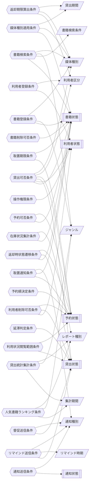

<!-- generateRdraMd.js による自動生成ファイル。手動編集しないこと。元データ: docs/requirements/rdra/*.tsv -->

# 条件・バリエーション

RDRA システム内部レイヤー。判断条件（ビジネスルール）と区分・種別の一覧。

## 条件（ビジネスルール）

> 凡例: `{{六角}}` 条件 / `[[二重枠]]` 状態モデル / `[/斜め/]` バリエーション

| コンテキスト | 条件 | 条件の説明 | バリエーション | 状態モデル |
|---|---|---|---|---|
| 蔵書管理 | 書籍登録条件 | 書籍はタイトル・著者・ISBN・出版社・ジャンル・媒体種別を指定して登録する。ISBNが同一の書籍を重複して登録しない。登録した書籍の書籍状態は在庫ありとする | ジャンル、媒体種別 | 書籍状態 |
| 蔵書管理 | 書籍削除可否条件 | 書籍状態が在庫ありの書籍だけを削除できる。貸出中または予約待ち（取置）の書籍は削除できない。削除した書籍の書籍状態は削除済みとする |  | 書籍状態 |
| 蔵書管理 | 書籍検索条件 | キーワードはタイトル・著者などへの部分一致で検索し、タイトル・著者・ISBN・ジャンル・媒体種別を個別の条件として絞り込める。削除済みの書籍は検索対象外とし、検索結果に媒体種別と書籍状態（在庫状況）を表示する | 書籍検索条件、ジャンル、媒体種別 | 書籍状態 |
| 蔵書管理 | 媒体種別適用条件 | 書籍は媒体種別（紙・電子）を必ず持ち、媒体種別に応じて貸出期間や状態管理の扱いを切り替えられるようにする。現在は紙書籍を扱い、将来の電子書籍追加時に仕組みを作り直さずに拡張する | 媒体種別、貸出期間 | 書籍状態 |
| 利用者管理 | 利用者登録条件 | 利用者は氏名と連絡先（メールアドレス）を必須として登録し、登録時に一意の利用者番号を付与する。登録した利用者の利用者状態は有効とする | 利用者区分 | 利用者状態 |
| 利用者管理 | 利用者削除可否条件 | 貸出状態が貸出中または延滞の貸出を持つ利用者、または予約状態が予約中・取置中の予約を持つ利用者は削除できない。削除した利用者の利用者状態は削除済みとする |  | 利用者状態、貸出状態、予約状態 |
| 利用者管理 | 操作権限条件 | 書籍・利用者の登録・編集・削除、貸出・返却の登録、予約状況・通知送信状況・延滞貸出の照会、レポートの閲覧は司書だけが行える。予約と自分の利用状況の確認は利用者状態が有効な利用者がログインして行える |  | 利用者状態 |
| 利用者管理 | 利用状況閲覧範囲条件 | ログインした利用者は自分の貸出（貸出中・延滞・返却済み）と予約（予約中・取置中・受取済み・取消済み）だけを閲覧でき、他の利用者の情報は閲覧できない |  | 貸出状態、予約状態 |
| 貸出管理 | 貸出可否条件 | 書籍状態が在庫ありであり、利用者状態が有効で延滞中の貸出を持たず、利用者区分ごとの貸出上限冊数を超えない場合に貸出できる。書籍状態が予約待ち（取置）の書籍は、予約状態が取置中である予約順1位の利用者にだけ貸出できる | 利用者区分、媒体種別 | 書籍状態、利用者状態、貸出状態、予約状態 |
| 貸出管理 | 返却期限算出条件 | 返却期限は貸出日に利用者区分と媒体種別に応じた貸出期間（7日・14日・21日）を加算して算出する | 利用者区分、媒体種別、貸出期間 |  |
| 貸出管理 | 返却時状態遷移条件 | 返却された書籍に予約状態が予約中の予約があれば書籍状態を予約待ち（取置）にし、予約がなければ在庫ありにする。貸出状態は貸出中・延滞のいずれからも返却済みにする |  | 書籍状態、貸出状態、予約状態 |
| 貸出管理 | リマインド送信条件 | 貸出状態が貸出中で、返却期限までの日数がリマインド時期（返却期限の3日前・1日前）に一致する未返却の貸出の利用者にリマインドメールを送信する | リマインド時期、通知種別 | 貸出状態 |
| 貸出管理 | 延滞判定条件 | 日次の期限チェックで、貸出状態が貸出中のまま返却期限を過ぎても返却されていない貸出を延滞と判定し、貸出状態を延滞にする |  | 貸出状態 |
| 貸出管理 | 督促送信条件 | 貸出状態が延滞になった貸出の利用者に督促メールを送信する | 通知種別 | 貸出状態 |
| 予約管理 | 予約可否条件 | 書籍状態が貸出中または予約待ち（取置）の書籍に限り予約できる。在庫ありの書籍は予約できず、同じ利用者が同じ書籍に予約状態が予約中・取置中の予約を重複して持てない |  | 書籍状態、予約状態 |
| 予約管理 | 予約順決定条件 | 予約は受付日時の先着順に予約順を付与し、予約状態が取消済み・受取済みになった予約を除いて順位を繰り上げる |  | 予約状態 |
| 予約管理 | 取置通知条件 | 予約のある書籍が返却されたら、予約順1位の予約の予約状態を取置中にし、その利用者にだけ取置通知を送信する | 通知種別 | 予約状態、書籍状態 |
| 予約管理 | 取置期限条件 | 取置期限は取置開始日に所定の取置日数を加算して設定する。取置期限を過ぎても受け取られない取置中の予約は予約状態を取消済みにし、次の予約者がいれば取置を移し、いなければ書籍状態を在庫ありに戻す |  | 予約状態、書籍状態 |
| 通知管理 | 通知送信条件 | 通知は通知種別（取置通知・リマインド・督促）に応じた内容で、利用者に登録されたメールアドレスへメール配信サービス経由で送信する。送信に成功すれば通知状態を送信済み、失敗すれば送信失敗とし、送信失敗の通知は再送対象として送信待ちに戻せる | 通知種別 | 通知状態 |
| 蔵書分析管理 | 在庫状況集計条件 | 削除済みを除く書籍を書籍状態（在庫あり・貸出中・予約待ち（取置））ごとに分類し、状態ごとの書籍と件数を集計する | レポート種別 | 書籍状態 |
| 蔵書分析管理 | 人気書籍ランキング条件 | 集計期間内の貸出回数を書籍ごとに集計し、貸出回数の多い順に並べる | 集計期間、ジャンル、レポート種別 |  |
| 蔵書分析管理 | 貸出統計集計条件 | 指定された開始日から終了日までの集計期間に含まれる貸出を対象に貸出件数を集計する | 集計期間、ジャンル、レポート種別 |  |

## バリエーション

| コンテキスト | バリエーション | 値 | 説明 |
|---|---|---|---|
| 蔵書管理 | ジャンル | 文学、歴史、自然科学、社会科学、芸術、技術・工学、児童書、参考図書 | 書籍を分類して登録するための区分。書籍検索の条件や人気書籍ランキング・貸出統計の分類軸として使う |
| 蔵書管理 | 媒体種別 | 紙、電子 | 書籍の媒体を表す区分。現在は紙書籍を扱い、将来の電子書籍追加時に書籍管理の仕組みを作り直さずに拡張するために使う。検索結果にも表示する |
| 蔵書管理 | 書籍検索条件 | キーワード、タイトル、著者、ISBN、ジャンル | 書籍を検索するときの検索条件の種類を表す区分。司書・利用者が条件を選んで書籍を絞り込むために使う |
| 利用者管理 | 利用者区分 | 一般、児童、学生 | 利用者の種類を表す区分。利用者区分ごとに貸出期間や貸出上限冊数を変える貸出可否条件・返却期限算出の判断に使う |
| 貸出管理 | 貸出期間 | 7日、14日、21日 | 貸出日から返却期限を自動算出するための期間の区分。利用者区分や媒体種別に応じて適用する期間を決める |
| 貸出管理 | リマインド時期 | 返却期限の3日前、返却期限の1日前 | 返却期限が近づいた貸出の利用者にリマインドメールを送るタイミングの区分。日次の期限チェックでリマインド送信条件の判定に使う |
| 通知管理 | 通知種別 | 取置通知、リマインド、督促 | 利用者へ送る通知の目的を表す区分。予約書籍の取置通知、返却期限前のリマインドメール、延滞時の督促メールを送り分けるために使う |
| 蔵書分析管理 | 集計期間 | 日次、週次、月次、年次、任意期間 | 人気書籍ランキングや貸出統計を集計する対象期間の区分。任意期間は司書が開始日と終了日を指定する |
| 蔵書分析管理 | レポート種別 | 在庫状況レポート、人気書籍ランキング、貸出統計 | 司書が蔵書の利用状況を把握するためのレポートの種類を表す区分。蔵書の利用状況分析で表示する内容を切り替えるために使う |
