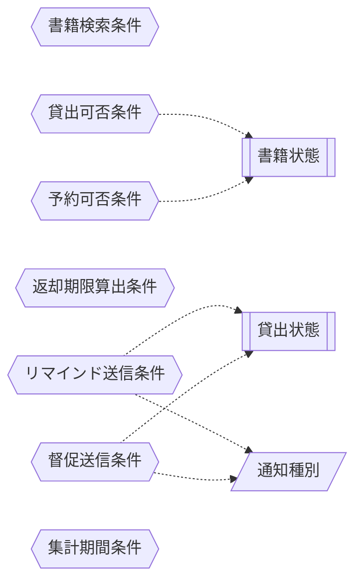

<!-- generateRdraMd.js による自動生成ファイル。手動編集しないこと。元データ: docs/requirements/rdra/*.tsv -->

# 条件・バリエーション

RDRA システム内部レイヤー。判断条件（ビジネスルール）と区分・種別の一覧。

## 条件（ビジネスルール）

> 凡例: `{{六角}}` 条件 / `[[二重枠]]` 状態モデル / `[/斜め/]` バリエーション

| コンテキスト | 条件 | 条件の説明 | バリエーション | 状態モデル |
|---|---|---|---|---|
| 蔵書管理 | 書籍検索条件 | キーワード・タイトル・著者・ISBN・ジャンルのいずれかを指定し、一致する書籍だけを抽出する。キーワードはタイトル等に含まれる書籍を対象にし、削除済みの書籍は対象外とする |  |  |
| 貸出管理 | 貸出可否条件 | 書籍状態が在庫あり（予約待ちの場合は予約順 1 位の利用者のみ）で、登録済みの利用者であれば貸出できる。貸出中の書籍は貸出できない |  | 書籍状態 |
| 予約管理 | 予約可否条件 | 書籍状態が貸出中の書籍だけを予約できる。在庫ありの書籍は予約できない。予約は受付順に予約順位を付ける |  | 書籍状態 |
| 貸出管理 | 返却期限算出条件 | 返却期限は貸出日に貸出期間を加えた日とする |  |  |
| 貸出管理 | リマインド送信条件 | 未返却の貸出で、返却期限までの日数がリマインド日数以内になった場合に、リマインドメールを 1 回だけ送信する | 通知種別 | 貸出状態 |
| 貸出管理 | 督促送信条件 | 未返却の貸出で返却期限を超過した場合に、貸出状態を延滞にして督促メールを送信する | 通知種別 | 貸出状態 |
| 蔵書分析管理 | 集計期間条件 | 司書が指定した開始日から終了日までの期間に含まれる貸出を集計対象とする |  |  |

## バリエーション

| コンテキスト | バリエーション | 値 | 説明 |
|---|---|---|---|
| 蔵書管理 | 媒体種別 | 紙の書籍、電子書籍 | 書籍の媒体を区分する。現時点は紙の書籍を扱い、将来の電子書籍の取り扱い開始時に蔵書管理の仕組みを作り直さずに種別を追加できるようにする |
| 通知管理 | 通知種別 | 返却通知、リマインド、督促 | 利用者へ送るメールの種類を区分する。返却通知は予約書籍の返却時、リマインドは返却期限前、督促は返却期限超過時に送信する |
| 蔵書分析管理 | レポート種別 | 在庫状況レポート、人気書籍ランキング、貸出統計 | 司書が蔵書分析で確認するレポートの種類を区分する |
