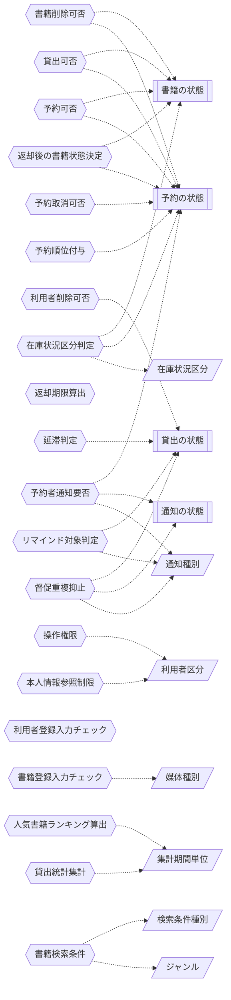

<!-- generateRdraMd.js による自動生成ファイル。手動編集しないこと。元データ: docs/requirements/rdra/*.tsv -->

# 条件・バリエーション

RDRA システム内部レイヤー。判断条件（ビジネスルール）と区分・種別の一覧。

## 条件（ビジネスルール）

> 凡例: `{{六角}}` 条件 / `[[二重枠]]` 状態モデル / `[/斜め/]` バリエーション

| コンテキスト | 条件 | 条件の説明 | バリエーション | 状態モデル |
|---|---|---|---|---|
| 蔵書管理 | 書籍削除可否 | 書籍の状態が貸出中または取り置き中の書籍、および待機中の予約がある書籍は削除できない。在庫ありかつ予約の無い書籍だけ削除できる |  | 書籍の状態、予約の状態 |
| 利用者管理 | 利用者削除可否 | 貸出の状態が貸出中または延滞中の貸出がある利用者は削除できない。貸出中の書籍が無い利用者だけ削除できる |  | 貸出の状態 |
| 貸出管理 | 貸出可否 | 書籍の状態が在庫ありの書籍、またはその利用者向けに取り置き中の書籍だけ貸し出せる。貸出中の書籍や他の利用者向けに取り置き中の書籍は貸し出せない |  | 書籍の状態、予約の状態 |
| 予約管理 | 予約可否 | 書籍の状態が貸出中の書籍だけ予約できる。在庫ありの書籍は予約できない。同じ利用者が同じ書籍を待機中または取り置き中で予約済みの場合は重複予約できない |  | 書籍の状態、予約の状態 |
| 予約管理 | 予約取消可否 | 利用者本人の予約で、予約の状態が待機中のものだけ取り消せる。取り消すと後続の予約順位が1つ繰り上がる |  | 予約の状態 |
| 予約管理 | 予約順位付与 | 予約は受付順に予約順位を付ける。先に受け付けた予約ほど上位になる。待機中の予約が取消済みになると後続の予約順位を繰り上げる |  | 予約の状態 |
| 蔵書管理 | 返却後の書籍状態決定 | 返却時に待機中の予約が無ければ書籍は在庫ありに戻す。待機中の予約があれば予約順1位の利用者向けの取り置き中にし、その予約を取り置き中にする |  | 書籍の状態、予約の状態 |
| 通知管理 | 予約者通知要否 | 返却により予約が取り置き中になった場合だけ、予約順1位の利用者に通知種別が受取可能通知のメールを送る。予約の無い書籍の返却では送らない | 通知種別 | 予約の状態、通知の状態 |
| 貸出管理 | 返却期限算出 | 返却期限は貸出日に貸出ルールの貸出期間(ビジネスパラメータ)を加えて一律に算出する |  |  |
| 通知管理 | リマインド対象判定 | 返却期限の所定日数前(リマインド日数)に達した貸出の状態が貸出中の貸出だけを、通知種別が返却期限リマインドの対象とする。返却済みの貸出は対象外とする | 通知種別 | 貸出の状態 |
| 貸出管理 | 延滞判定 | 返却期限を超過した貸出の状態が貸出中の貸出を延滞中とする |  | 貸出の状態 |
| 通知管理 | 督促重複抑止 | 延滞中の貸出に対して同じ日に通知種別が延滞督促の通知が送信済みの場合は、同じ日に督促メールを再送しない | 通知種別 | 貸出の状態、通知の状態 |
| 利用者管理 | 操作権限 | 利用者区分が司書の場合だけ書籍・利用者の管理、貸出・返却の登録、レポートの閲覧を行える。利用者区分が利用者の場合は書籍の検索、予約・予約取消、自分の利用状況の確認だけ行える | 利用者区分 |  |
| 利用者管理 | 本人情報参照制限 | 利用者区分が利用者の場合は自分の貸出・予約情報だけを参照できる。他の利用者の貸出・予約情報は参照できない | 利用者区分 |  |
| 蔵書管理 | 書籍登録入力チェック | タイトルは必須とする。媒体種別が未指定の場合は紙として登録する。同じISBNの書籍は別の所蔵資料(蔵書)として既存の書籍情報に紐づけて追加する | 媒体種別 |  |
| 利用者管理 | 利用者登録入力チェック | 連絡先のメールアドレスは正しい形式でなければ登録できない。利用者番号はシステムが一意に採番する |  |  |
| 蔵書分析管理 | 在庫状況区分判定 | 書籍の状態が貸出中なら貸出中、在庫ありなら在庫あり、予約の状態が待機中の予約がある書籍は予約待ちとして在庫状況区分を決める | 在庫状況区分 | 書籍の状態、予約の状態 |
| 蔵書分析管理 | 人気書籍ランキング算出 | 指定期間内の貸出回数を書籍ごとに集計し、貸出回数の多い順に並べる | 集計期間単位 |  |
| 蔵書分析管理 | 貸出統計集計 | 貸出件数を集計期間単位(日・月・年)ごとに集計する | 集計期間単位 |  |
| 蔵書管理 | 書籍検索条件 | キーワード、タイトル、著者、ISBN、ジャンルの検索条件種別で書籍を絞り込む。ISBNは完全一致、キーワードはタイトル等への部分一致、ジャンルは指定ジャンルとの一致とする | 検索条件種別、ジャンル |  |

## バリエーション

| コンテキスト | バリエーション | 値 | 説明 |
|---|---|---|---|
| 蔵書管理 | ジャンル | 文学、歴史、社会科学、自然科学、技術、芸術、児童書、その他 | 書籍を分類する区分。UC「書籍を登録する」「書籍情報を編集する」で書籍に設定し、UC「書籍を検索する」「書籍の所在を検索する」のジャンル指定検索と貸出統計の分析に使う |
| 蔵書管理 | 媒体種別 | 紙、電子 | 書籍の媒体を区別する区分。条件「書籍登録入力チェック」で未指定時は紙とする。当面は紙のみ運用し、電子書籍の貸出方法は将来決める |
| 蔵書管理 | 検索条件種別 | キーワード、タイトル、著者、ISBN、ジャンル | 書籍検索で指定できる条件の種類。条件「書籍検索条件」で使い、利用者と司書が目的の書籍と在庫状況を見つけるために使う |
| 利用者管理 | 利用者区分 | 利用者、司書 | ログインした人の役割の区分。条件「操作権限」で蔵書・利用者管理、貸出・返却登録、レポートを司書だけに許可する判断に使う |
| 通知管理 | 通知種別 | 受取可能通知、返却期限リマインド、延滞督促 | 利用者へメール配信サービス経由で自動送信する通知の種類。送信契機と文面を切り替え、条件「督促重複抑止」で同日の重複送信の抑止に使う |
| 蔵書分析管理 | 在庫状況区分 | 在庫あり、貸出中、予約待ち | 在庫状況レポートと検索結果で書籍を集計・表示する区分。条件「在庫状況区分判定」で書籍の状態と予約から決め、司書が蔵書の運用状況を把握するために使う |
| 蔵書分析管理 | 集計期間単位 | 日、月、年 | 貸出統計と人気書籍ランキングを集計する期間の単位。条件「貸出統計集計」「人気書籍ランキング算出」で使い、司書が期間別の利用傾向を把握するために使う |
