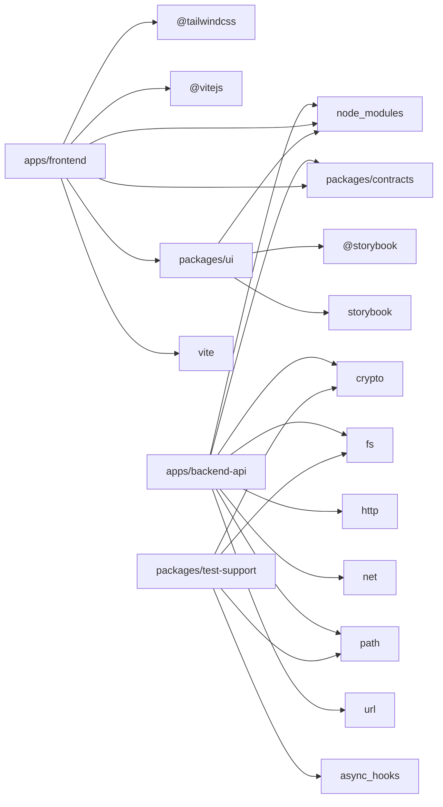

# 依存グラフ (抽出)

## 実態 (dependency-cruiser)

コードの import から抽出した実際の依存。

```mermaid
graph LR
  n__storybook["@storybook"]
  n__tailwindcss["@tailwindcss"]
  n__vitejs["@vitejs"]
  n_apps_backend_api["apps/backend-api"]
  n_apps_frontend["apps/frontend"]
  n_async_hooks["async_hooks"]
  n_crypto["crypto"]
  n_fs["fs"]
  n_http["http"]
  n_net["net"]
  n_node_modules["node_modules"]
  n_packages_contracts["packages/contracts"]
  n_packages_test_support["packages/test-support"]
  n_packages_ui["packages/ui"]
  n_path["path"]
  n_storybook["storybook"]
  n_url["url"]
  n_vite["vite"]
  n_apps_backend_api --> n_crypto
  n_apps_backend_api --> n_fs
  n_apps_backend_api --> n_http
  n_apps_backend_api --> n_net
  n_apps_backend_api --> n_node_modules
  n_apps_backend_api --> n_packages_contracts
  n_apps_backend_api --> n_path
  n_apps_backend_api --> n_url
  n_apps_frontend --> n__tailwindcss
  n_apps_frontend --> n__vitejs
  n_apps_frontend --> n_node_modules
  n_apps_frontend --> n_packages_contracts
  n_apps_frontend --> n_packages_ui
  n_apps_frontend --> n_vite
  n_packages_test_support --> n_async_hooks
  n_packages_test_support --> n_crypto
  n_packages_test_support --> n_fs
  n_packages_test_support --> n_path
  n_packages_ui --> n__storybook
  n_packages_ui --> n_node_modules
  n_packages_ui --> n_storybook
```

## 違反

違反なし。
